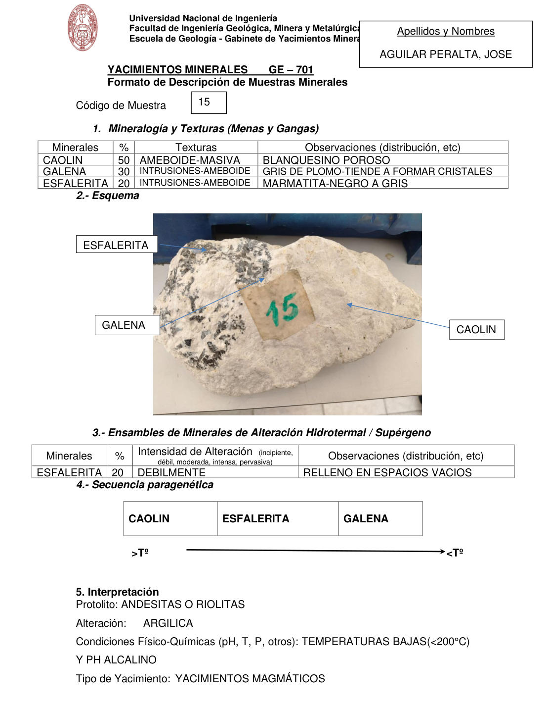

# Muestra 15

- **Autor:** Aguilar Peralta, Jose Luis
- **Fuente:** YACIMIENTOS-AGUILAR_PERALTA_JOSE_LUIS.pdf (pagina 4)
- **Confianza transcripcion:** alta

## 1. Mineralogia y Texturas (Menas y Gangas)
| Mineral | % | Texturas | Observaciones |
|---|---|---|---|
| Caolin | 50 | Ameboide-masiva | Blanquecino poroso |
| Galena | 30 | Intrusiones-ameboide | Gris de plomo; tiende a formar cristales |
| Esfalerita | 20 | Intrusiones-ameboide | Marmatita, negro a gris |

## 2. Esquema
Fotografia de la muestra de mano, blanquecina, con rotulo '15'. Etiquetas: caolin (masa blanca), galena y esfalerita (granos y parches negros a gris).

## 3. Ensambles de Minerales de Alteracion
| Mineral | % | Intensidad | Observaciones |
|---|---|---|---|
| Esfalerita | 20 | debil | Relleno en espacios vacios |

## 4. Secuencia paragenetica
De mayor a menor temperatura: caolin, esfalerita y galena.
| Mineral / asociacion | Etapa | Notas |
|---|---|---|
| Caolin |  |  |
| Esfalerita |  |  |
| Galena |  |  |

## 5. Interpretacion
- **Protolito:** Andesitas o riolitas
- **Alteraciones:** Argilica
- **Condiciones Fisico-Quimicas:** Temperaturas bajas (<200 C) y pH alcalino
- **Tipo de Yacimiento:** Yacimientos magmaticos

> Notas: PDF digital (texto seleccionable), no manuscrito: la transcripcion es literal. El esquema de la seccion 2 es una fotografia de la muestra de mano, no un dibujo. Grupo del informe: A) Yacimientos magmaticos (separador en pagina 2). El recuadro 'Codigo de Muestra' solo dice '15' (sin el prefijo 'MA - T -'), y el rotulo de la foto tambien dice '15'; se transcribe tal cual. Probablemente corresponda a MA-T-15, pero no se corrige. La intensidad figura como 'DEBILMENTE'.
