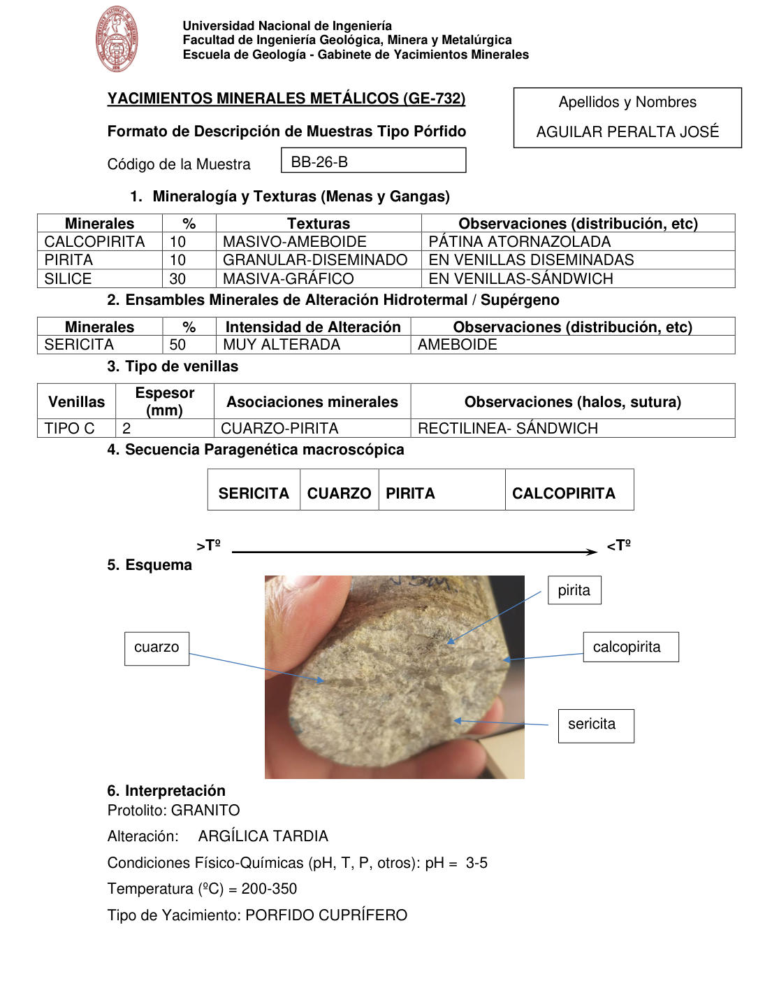

# Muestra BB-26-B

- **Autor:** Aguilar Peralta, Jose Luis
- **Formato:** GE-732 Tipo Porfido
- **Fuente:** YACIMIENTOS-AGUILAR_PERALTA_JOSE_LUIS.pdf (pagina 11)
- **Confianza transcripcion:** alta

## 1. Mineralogia y Texturas (Menas y Gangas)
| Mineral | % | Texturas | Observaciones |
|---|---|---|---|
| Calcopirita | 10 | Masivo-ameboide | Patina atornasolada |
| Pirita | 10 | Granular-diseminado | En venillas diseminadas |
| Silice | 30 | Masiva-grafico | En venillas, sandwich |

## 2. Esquema
Fotografia de la muestra de mano (testigo) sostenida con la mano, de tono pardo claro. Etiquetas: cuarzo, pirita, calcopirita y sericita.

## 3. Ensambles de Minerales de Alteracion
| Mineral | % | Intensidad | Observaciones |
|---|---|---|---|
| Sericita | 50 | muy alterada | Ameboide |

## Tipo de venillas
| Venilla | Espesor (mm) | Asociaciones minerales | Observaciones |
|---|---|---|---|
| Tipo C | 2 | Cuarzo-pirita | Rectilinea, sandwich |

## 4. Secuencia paragenetica
De mayor a menor temperatura: sericita, cuarzo, pirita y calcopirita.
| Mineral / asociacion | Etapa | Notas |
|---|---|---|
| Sericita |  |  |
| Cuarzo |  |  |
| Pirita |  |  |
| Calcopirita |  |  |

## 5. Interpretacion
- **Protolito:** Granito
- **Alteraciones:** Argilica tardia
- **Condiciones Fisico-Quimicas:** pH = 3-5; Temperatura = 200-350 C
- **Tipo de Yacimiento:** Porfido cuprifero

> Notas: PDF digital (texto seleccionable), no manuscrito: la transcripcion es literal. Hoja del formato 'YACIMIENTOS MINERALES METALICOS (GE-732) - Formato de Descripcion de Muestras Tipo Porfido', que ademas del GE-701 trae una seccion 'Tipo de venillas' (campo venillas). El esquema es una fotografia de la muestra de mano. Grupo del informe: B) Yacimientos tipo porfidos (separador en pagina 10).
