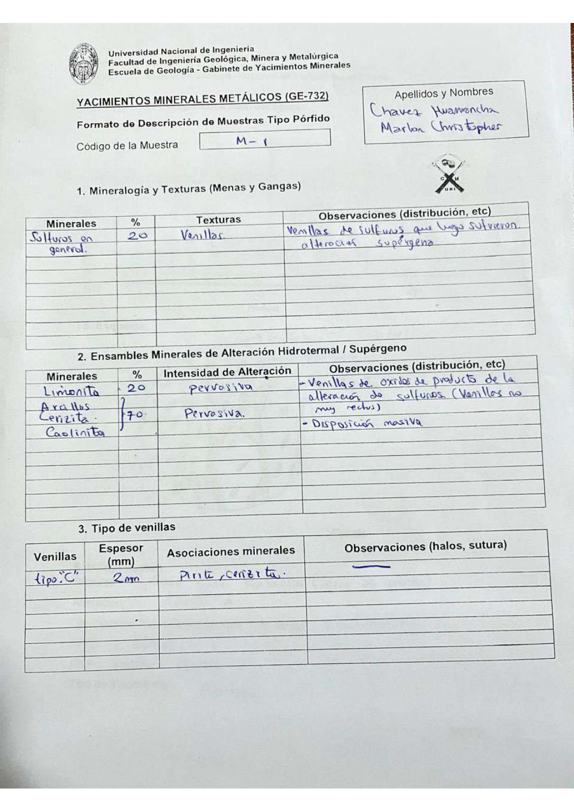

# Muestra M - 1

- **Autor:** Chavez Huamancha, Marlon Christopher
- **Formato:** GE-732 Tipo Porfido
- **Fuente:** PORFIDOS_MUESTRAS.pdf (pagina 11)
- **Confianza transcripcion:** alta

## 1. Mineralogia y Texturas (Menas y Gangas)
| Mineral | % | Texturas | Observaciones |
|---|---|---|---|
| Sulfuros en general | 20 | Venillas | Venillas de sulfuros que luego sufrieron alteracion supergena |

## 2. Esquema
Dibujo circular (vista de lupa) de fondo anaranjado cortado por venillas azul-verdosas entrecruzadas, senaladas como venilla tipo C.

## 3. Ensambles de Minerales de Alteracion
| Mineral | % | Intensidad | Observaciones |
|---|---|---|---|
| Limonita | 20 | pervasiva | Venillas de oxidos producto de la alteracion de sulfuros (venillas no muy rectas) |
| Arcillas, sericita y caolinita | 70 | pervasiva | Disposicion masiva |

## Tipo de venillas
| Venilla | Espesor (mm) | Asociaciones minerales | Observaciones |
|---|---|---|---|
| Tipo C | 2 | Pirita, sericita |  |

## 4. Secuencia paragenetica
De mayor a menor temperatura: arcillas, sericita, caolinita y oxidos en general.
| Mineral / asociacion | Etapa | Notas |
|---|---|---|
| Arcillas |  |  |
| Sericita |  |  |
| Caolinita |  |  |
| Oxidos en general |  |  |

## 5. Interpretacion
- **Protolito:** No se puede determinar
- **Alteraciones:** Argilica o filica
- **Condiciones Fisico-Quimicas:** pH neutro a basico; T = 360-420 C
- **Tipo de Yacimiento:** Yacimiento porfido

> Notas: Escaneo de hoja manuscrita, leido con vision. Cada muestra ocupa dos paginas (anverso con las secciones 1-3 y reverso con las 4-6), pero el PDF NO las trae consecutivas: el emparejamiento se reconstruyo por contenido. El campo 'pagina' apunta al anverso (el que lleva el codigo) y es la imagen guardada en page.jpg. Reverso de esta muestra: pagina 14. Las arcillas, sericita y caolinita comparten una llave con un solo % (70) en la tabla 2. En el reverso el rango de temperatura aparece escrito dos veces, en la linea de pH (360-470) y en la de Temperatura (360-420); se toma el de la linea de Temperatura.
