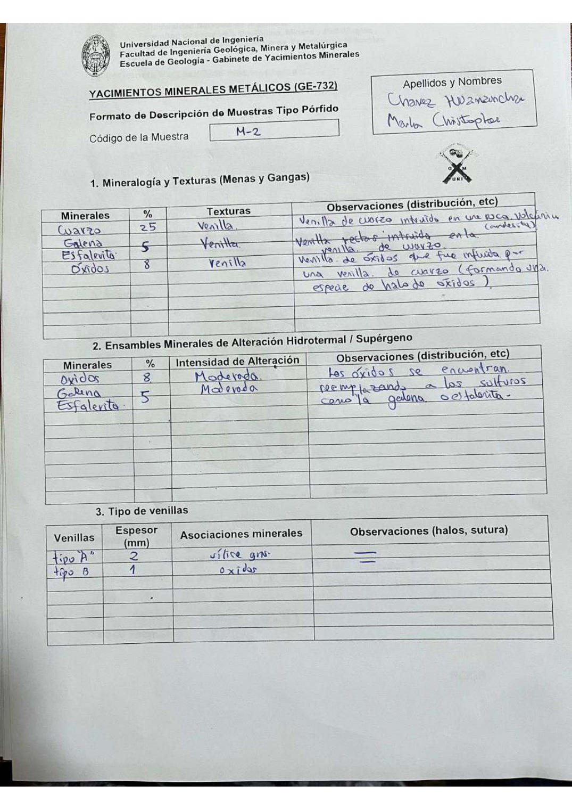

# Muestra M - 2

- **Autor:** Chavez Huamancha, Marlon Christopher
- **Formato:** GE-732 Tipo Porfido
- **Fuente:** PORFIDOS_MUESTRAS.pdf (pagina 15)
- **Confianza transcripcion:** alta

## 1. Mineralogia y Texturas (Menas y Gangas)
| Mineral | % | Texturas | Observaciones |
|---|---|---|---|
| Cuarzo | 25 | Venilla | Venilla de cuarzo intruida en una roca volcanica (andesita) |
| Galena y esfalerita | 5 | Venilla | Venillas rectas intruidas en la venilla de cuarzo |
| Oxidos | 8 | Venilla | Venilla de oxidos que fue intruida por una venilla de cuarzo (formando una especie de halo de oxidos) |

## 2. Esquema
Dibujo circular (vista de lupa) de fondo anaranjado atravesado por venillas claras sinuosas: se senalan la venilla tipo B (izquierda) y la venilla tipo A (derecha).

## 3. Ensambles de Minerales de Alteracion
| Mineral | % | Intensidad | Observaciones |
|---|---|---|---|
| Oxidos | 8 | moderada | Los oxidos se encuentran reemplazando a los sulfuros como la galena o esfalerita |
| Galena y esfalerita | 5 | moderada |  |

## Tipo de venillas
| Venilla | Espesor (mm) | Asociaciones minerales | Observaciones |
|---|---|---|---|
| Tipo A | 2 | Silice gris |  |
| Tipo B | 1 | Oxidos |  |

## 4. Secuencia paragenetica
De mayor a menor temperatura: cuarzo, sulfuros y oxidos.
| Mineral / asociacion | Etapa | Notas |
|---|---|---|
| Cuarzo |  |  |
| Sulfuros |  |  |
| Oxidos |  |  |

## 5. Interpretacion
- **Protolito:** Roca volcanica
- **Alteraciones:** Supergena (oxidacion de los sulfuros)
- **Condiciones Fisico-Quimicas:** Condiciones supergenas; T = 360-460 C; pH neutro a basico (5-7)
- **Tipo de Yacimiento:** Porfido

> Notas: Escaneo de hoja manuscrita, leido con vision. Cada muestra ocupa dos paginas (anverso con las secciones 1-3 y reverso con las 4-6), pero el PDF NO las trae consecutivas: el emparejamiento se reconstruyo por contenido. El campo 'pagina' apunta al anverso (el que lleva el codigo) y es la imagen guardada en page.jpg. Reverso de esta muestra: pagina 16. La galena y la esfalerita comparten una sola celda de % (5) en las tablas 1 y 2.
