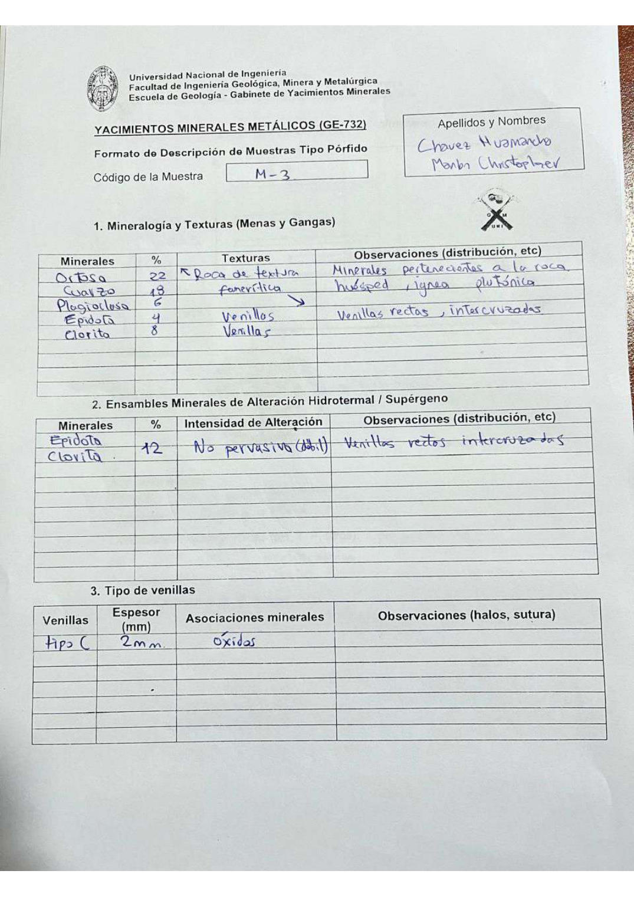

# Muestra M - 3

- **Autor:** Chavez Huamancha, Marlon Christopher
- **Formato:** GE-732 Tipo Porfido
- **Fuente:** PORFIDOS_MUESTRAS.pdf (pagina 13)
- **Confianza transcripcion:** alta

## 1. Mineralogia y Texturas (Menas y Gangas)
| Mineral | % | Texturas | Observaciones |
|---|---|---|---|
| Ortosa | 22 | Roca de textura faneritica | Minerales pertenecientes a la roca huesped, ignea plutonica |
| Cuarzo | 18 | Roca de textura faneritica | Minerales pertenecientes a la roca huesped, ignea plutonica |
| Plagioclasa | 6 | Roca de textura faneritica | Minerales pertenecientes a la roca huesped, ignea plutonica |
| Epidota | 4 | Venillas | Venillas rectas, intercruzadas |
| Clorita | 8 | Venillas | Venillas rectas, intercruzadas |

## 2. Esquema
Dibujo circular (vista de lupa) con venillas anaranjadas ramificadas (tipo C, oxidos) sobre fondo claro, y granos alargados celestes (clorita) y naranjas (epidota) dispersos.

## 3. Ensambles de Minerales de Alteracion
| Mineral | % | Intensidad | Observaciones |
|---|---|---|---|
| Epidota y clorita | 12 | no pervasiva (debil) | Venillas rectas intercruzadas |

## Tipo de venillas
| Venilla | Espesor (mm) | Asociaciones minerales | Observaciones |
|---|---|---|---|
| Tipo C | 2 | Oxidos |  |

## 4. Secuencia paragenetica
De mayor a menor temperatura: minerales de la roca huesped, epidota y clorita.
| Mineral / asociacion | Etapa | Notas |
|---|---|---|
| Minerales de roca huesped |  |  |
| Epidota |  |  |
| Clorita |  |  |

## 5. Interpretacion
- **Protolito:** Roca ignea plutonica (serie de granito)
- **Alteraciones:** Propilitico
- **Condiciones Fisico-Quimicas:** Fracturamiento; T = 350 C; pH neutro (5-7)
- **Tipo de Yacimiento:** Porfido

> Notas: Escaneo de hoja manuscrita, leido con vision. Cada muestra ocupa dos paginas (anverso con las secciones 1-3 y reverso con las 4-6), pero el PDF NO las trae consecutivas: el emparejamiento se reconstruyo por contenido. El campo 'pagina' apunta al anverso (el que lleva el codigo) y es la imagen guardada en page.jpg. Reverso de esta muestra: pagina 12. La textura 'Roca de textura faneritica' esta escrita con una llave que abarca las tres primeras filas; se repite en cada una. La epidota y la clorita comparten un solo % (12) en la tabla 2.
