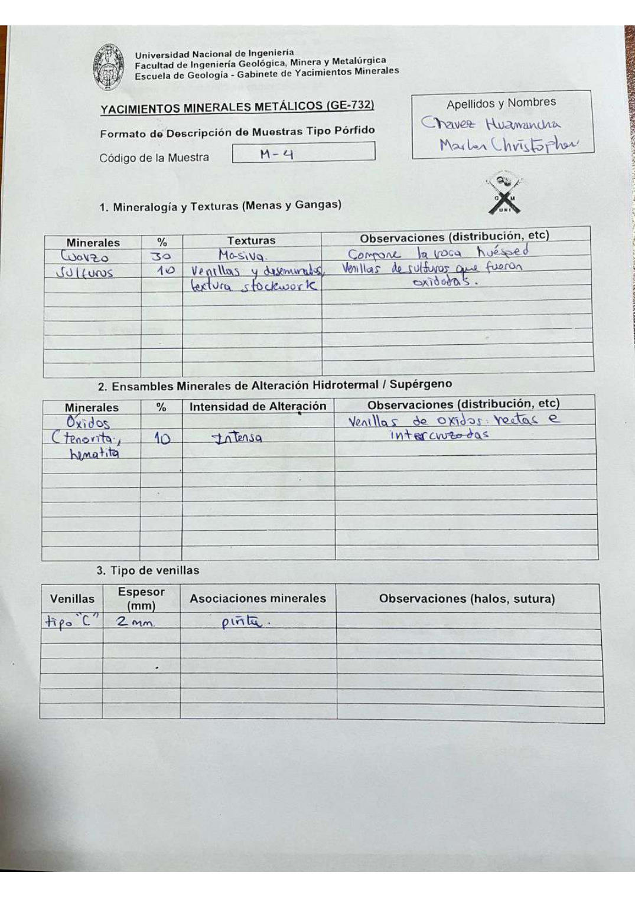

# Muestra M - 4

- **Autor:** Chavez Huamancha, Marlon Christopher
- **Formato:** GE-732 Tipo Porfido
- **Fuente:** PORFIDOS_MUESTRAS.pdf (pagina 17)
- **Confianza transcripcion:** alta

## 1. Mineralogia y Texturas (Menas y Gangas)
| Mineral | % | Texturas | Observaciones |
|---|---|---|---|
| Cuarzo | 30 | Masiva | Compone la roca huesped |
| Sulfuros | 10 | Venillas y diseminados, textura stockwork | Venillas de sulfuros que fueron oxidadas |

## 2. Esquema
Dibujo circular (vista de lupa) con venillas anaranjadas gruesas y venillas azules finas entrecruzadas sobre fondo claro; se senalan como venillas tipo C.

## 3. Ensambles de Minerales de Alteracion
| Mineral | % | Intensidad | Observaciones |
|---|---|---|---|
| Oxidos (tenorita, hematita) | 10 | intensa | Venillas de oxidos rectas e intercruzadas |

## Tipo de venillas
| Venilla | Espesor (mm) | Asociaciones minerales | Observaciones |
|---|---|---|---|
| Tipo C | 2 | Pirita |  |

## 4. Secuencia paragenetica
De mayor a menor temperatura: minerales de la roca huesped, sulfuros y oxidos en general.
| Mineral / asociacion | Etapa | Notas |
|---|---|---|
| Minerales de roca huesped |  |  |
| Sulfuros |  |  |
| Oxidos en general |  |  |

## 5. Interpretacion
- **Protolito:** Roca ignea
- **Alteraciones:** Filica o argilica, luego alteracion supergena
- **Condiciones Fisico-Quimicas:** Condiciones de ambiente supergeno; T = 350 C; pH neutro (7)
- **Tipo de Yacimiento:** Porfido

> Notas: Escaneo de hoja manuscrita, leido con vision. Cada muestra ocupa dos paginas (anverso con las secciones 1-3 y reverso con las 4-6), pero el PDF NO las trae consecutivas: el emparejamiento se reconstruyo por contenido. El campo 'pagina' apunta al anverso (el que lleva el codigo) y es la imagen guardada en page.jpg. Reverso de esta muestra: pagina 6. En la tabla 2 el % (10) y la intensidad se escribieron a la altura de la segunda linea del nombre del mineral.
