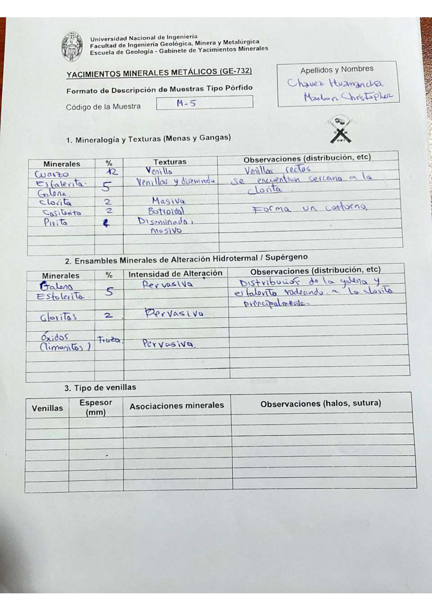

# Muestra M - 5

- **Autor:** Chavez Huamancha, Marlon Christopher
- **Formato:** GE-732 Tipo Porfido
- **Fuente:** PORFIDOS_MUESTRAS.pdf (pagina 3)
- **Confianza transcripcion:** alta

## 1. Mineralogia y Texturas (Menas y Gangas)
| Mineral | % | Texturas | Observaciones |
|---|---|---|---|
| Cuarzo | 12 | Venilla | Venillas rectas |
| Esfalerita y galena | 5 | Venillas y diseminado | Se encuentran cercanas a la clorita |
| Clorita | 2 | Masiva |  |
| Casiterita | 2 | Botroidal | Forma un contorno |
| Pirita | 2 | Diseminada, masivo |  |

## 2. Esquema
Dibujo circular (vista de lupa): fondo anaranjado surcado por venillas azules anchas y sinuosas; en la parte superior una zona gris clara.

## 3. Ensambles de Minerales de Alteracion
| Mineral | % | Intensidad | Observaciones |
|---|---|---|---|
| Galena y esfalerita | 5 | pervasiva | Distribucion de la galena y esfalerita rodeando a la clorita principalmente |
| Cloritas | 2 | pervasiva |  |
| Oxidos (limonitas) | traza | pervasiva |  |

## 4. Secuencia paragenetica
De mayor a menor temperatura: cuarzo, sulfuros, clorita, casiterita y pirita.
| Mineral / asociacion | Etapa | Notas |
|---|---|---|
| Cuarzo |  |  |
| Sulfuros |  |  |
| Clorita |  |  |
| Casiterita |  |  |
| Pirita |  |  |

## 5. Interpretacion
- **Protolito:** No identificable
- **Alteraciones:** Cloritizacion
- **Condiciones Fisico-Quimicas:** Condiciones de ambiente supergeno; T = 200-300 C; pH neutro a basico
- **Tipo de Yacimiento:** Porfido

> Notas: Escaneo de hoja manuscrita, leido con vision. Cada muestra ocupa dos paginas (anverso con las secciones 1-3 y reverso con las 4-6), pero el PDF NO las trae consecutivas: el emparejamiento se reconstruyo por contenido. El campo 'pagina' apunta al anverso (el que lleva el codigo) y es la imagen guardada en page.jpg. Reverso de esta muestra: pagina 4. La esfalerita y la galena comparten una sola celda de % (5) en la tabla 1, igual que en la tabla 2. La tabla de venillas esta vacia.
