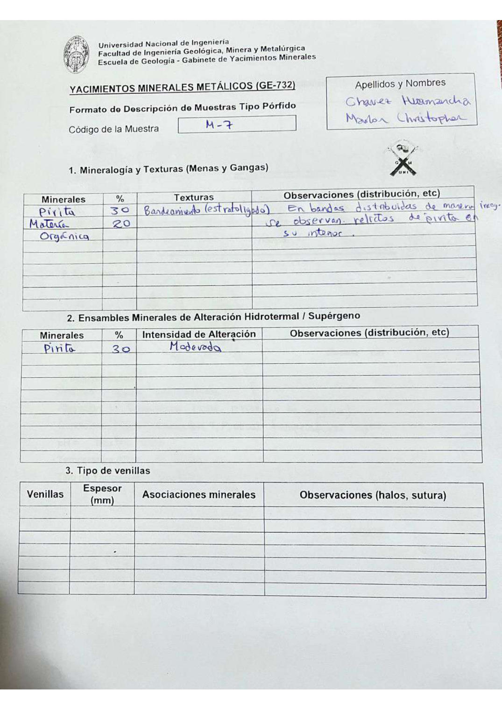

# Muestra M - 7

- **Autor:** Chavez Huamancha, Marlon Christopher
- **Formato:** GE-732 Tipo Porfido
- **Fuente:** PORFIDOS_MUESTRAS.pdf (pagina 9)
- **Confianza transcripcion:** alta

## 1. Mineralogia y Texturas (Menas y Gangas)
| Mineral | % | Texturas | Observaciones |
|---|---|---|---|
| Pirita | 30 | Bandeamiento (estratoligado) | En bandas distribuidas de manera irregular |
| Materia organica | 20 |  | Se observan relictos de pirita en su interior |

## 2. Esquema
Dibujo circular (vista de lupa) con bandas verticales anaranjadas irregulares sobre fondo claro.

## 3. Ensambles de Minerales de Alteracion
| Mineral | % | Intensidad | Observaciones |
|---|---|---|---|
| Pirita | 30 | moderada |  |

## 4. Secuencia paragenetica
Pirita primero y materia organica despues.
| Mineral / asociacion | Etapa | Notas |
|---|---|---|
| Pirita |  |  |
| Materia organica |  |  |

## 5. Interpretacion
- **Protolito:** Roca sedimentaria
- **Alteraciones:** Anaerobia (sin presencia de oxigeno)
- **Condiciones Fisico-Quimicas:** Temperaturas bajas; pH neutro (7)
- **Tipo de Yacimiento:** Porfido

> Notas: Escaneo de hoja manuscrita, leido con vision. Cada muestra ocupa dos paginas (anverso con las secciones 1-3 y reverso con las 4-6), pero el PDF NO las trae consecutivas: el emparejamiento se reconstruyo por contenido. El campo 'pagina' apunta al anverso (el que lleva el codigo) y es la imagen guardada en page.jpg. Reverso de esta muestra: pagina 10. La tabla de venillas esta vacia. La observacion de la tabla 1 se sale del margen derecho de la hoja escaneada.
