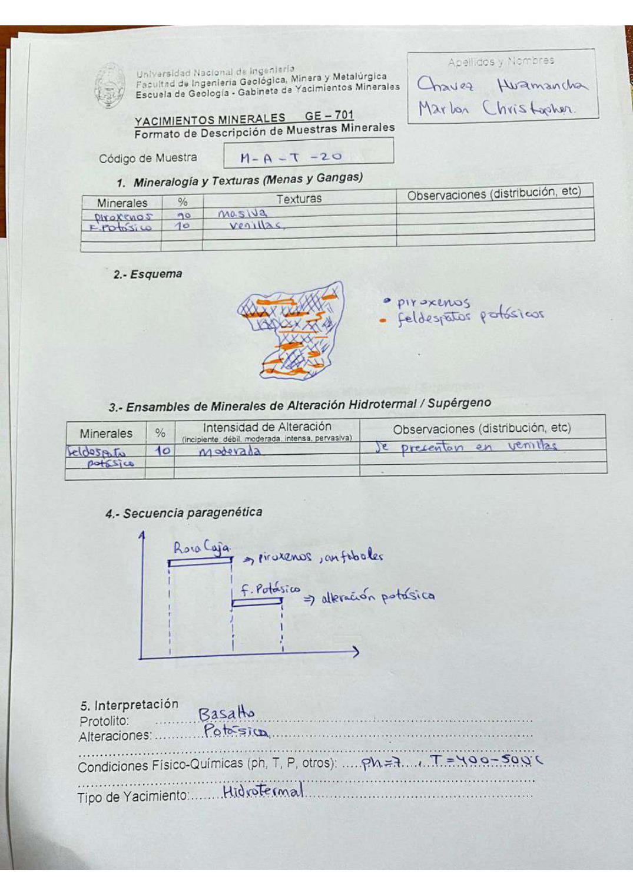

# Muestra M - A - T - 20

- **Autor:** Chavez Huamancha, Marlon Christopher
- **Fuente:** MAGMATICOS_MUESTRAS.pdf (pagina 4)
- **Confianza transcripcion:** alta

## 1. Mineralogia y Texturas (Menas y Gangas)
| Mineral | % | Texturas | Observaciones |
|---|---|---|---|
| Piroxenos | 90 | Masiva |  |
| Feldespato potasico | 10 | Venillas |  |

## 2. Esquema
Dibujo de la muestra con piroxenos (azul, trama cruzada) cortados por venillas de feldespato potasico (naranja).

## 3. Ensambles de Minerales de Alteracion
| Mineral | % | Intensidad | Observaciones |
|---|---|---|---|
| Feldespato potasico | 10 | moderada | Se presentan en venillas |

## 4. Secuencia paragenetica
Roca caja (piroxenos, anfiboles) y despues feldespato potasico, correspondiente a la alteracion potasica.
| Mineral / asociacion | Etapa | Notas |
|---|---|---|
| Roca caja | roca caja | Piroxenos, anfiboles |
| Feldespato potasico | alteracion potasica |  |

## 5. Interpretacion
- **Protolito:** Basalto
- **Alteraciones:** Potasica
- **Condiciones Fisico-Quimicas:** pH = 7; T = 400-500 C
- **Tipo de Yacimiento:** Hidrotermal

> Notas: Escaneo de hoja manuscrita, leido con vision. Carpeta = codigo saneado, colapsando los espacios alrededor de los guiones (p.ej. 'MA - T - 19' -> MA-T-19). El codigo esta escrito 'M - A - T - 20', con la M y la A separadas.
