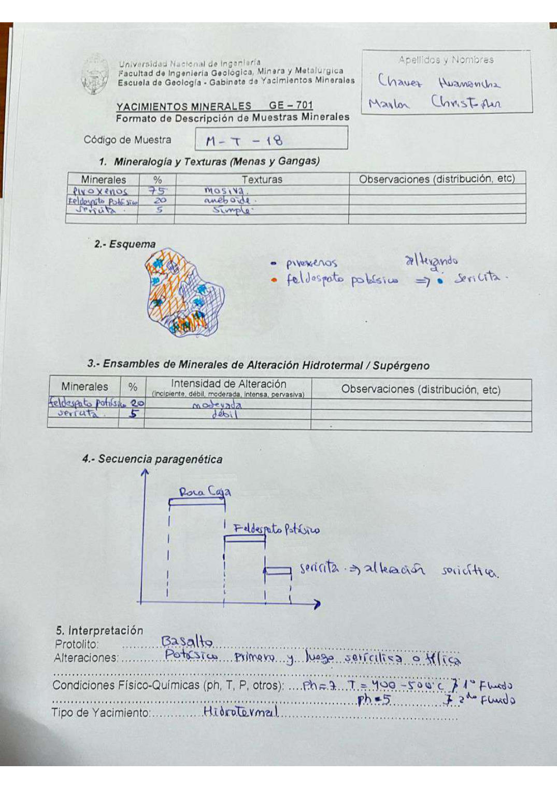

# Muestra M - T - 18

- **Autor:** Chavez Huamancha, Marlon Christopher
- **Fuente:** MAGMATICOS_MUESTRAS.pdf (pagina 6)
- **Confianza transcripcion:** alta

## 1. Mineralogia y Texturas (Menas y Gangas)
| Mineral | % | Texturas | Observaciones |
|---|---|---|---|
| Piroxenos | 75 | Masiva |  |
| Feldespato potasico | 20 | Ameboide |  |
| Sericita | 5 | Simple |  |

## 2. Esquema
Dibujo de la muestra con piroxenos (azul) y feldespato potasico (naranja) que se altera a sericita (celeste).

## 3. Ensambles de Minerales de Alteracion
| Mineral | % | Intensidad | Observaciones |
|---|---|---|---|
| Feldespato potasico | 20 | moderada |  |
| Sericita | 5 | debil |  |

## 4. Secuencia paragenetica
Roca caja, luego feldespato potasico y finalmente sericita (alteracion sericitica).
| Mineral / asociacion | Etapa | Notas |
|---|---|---|
| Roca caja | roca caja |  |
| Feldespato potasico | alteracion potasica |  |
| Sericita | alteracion sericitica |  |

## 5. Interpretacion
- **Protolito:** Basalto
- **Alteraciones:** Potasica primero y luego sericitica o filica
- **Condiciones Fisico-Quimicas:** 1er fluido: pH = 7, T = 400-500 C; 2do fluido: pH = 5
- **Tipo de Yacimiento:** Hidrotermal

> Notas: Escaneo de hoja manuscrita, leido con vision. Carpeta = codigo saneado, colapsando los espacios alrededor de los guiones (p.ej. 'MA - T - 19' -> MA-T-19). El codigo se escribe 'M - T - 18', sin la A.
