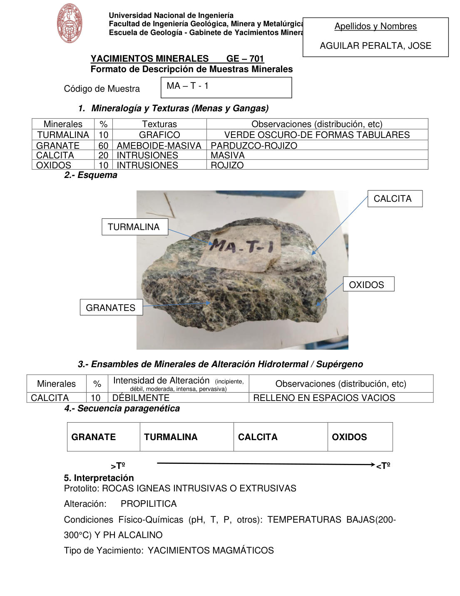

# Muestra MA - T - 1

- **Autor:** Aguilar Peralta, Jose Luis
- **Fuente:** YACIMIENTOS-AGUILAR_PERALTA_JOSE_LUIS.pdf (pagina 8)
- **Confianza transcripcion:** alta

## 1. Mineralogia y Texturas (Menas y Gangas)
| Mineral | % | Texturas | Observaciones |
|---|---|---|---|
| Turmalina | 10 | Grafico | Verde oscuro, de formas tabulares |
| Granate | 60 | Ameboide-masiva | Parduzco-rojizo |
| Calcita | 20 | Intrusiones | Masiva |
| Oxidos | 10 | Intrusiones | Rojizo |

## 2. Esquema
Fotografia de la muestra de mano con rotulo 'MA-T-1'. Roca parduzco-rojiza de granates, con turmalina verde oscura, calcita blanquecina y oxidos rojizos.

## 3. Ensambles de Minerales de Alteracion
| Mineral | % | Intensidad | Observaciones |
|---|---|---|---|
| Calcita | 10 | debil | Relleno en espacios vacios |

## 4. Secuencia paragenetica
De mayor a menor temperatura: granate, turmalina, calcita y oxidos.
| Mineral / asociacion | Etapa | Notas |
|---|---|---|
| Granate |  |  |
| Turmalina |  |  |
| Calcita |  |  |
| Oxidos |  |  |

## 5. Interpretacion
- **Protolito:** Rocas igneas intrusivas o extrusivas
- **Alteraciones:** Propilitica
- **Condiciones Fisico-Quimicas:** Temperaturas bajas (200-300 C) y pH alcalino
- **Tipo de Yacimiento:** Yacimientos magmaticos

> Notas: PDF digital (texto seleccionable), no manuscrito: la transcripcion es literal. El esquema de la seccion 2 es una fotografia de la muestra de mano, no un dibujo. Grupo del informe: A) Yacimientos magmaticos (separador en pagina 2). La intensidad figura como 'DEBILMENTE'. La calcita aparece con 20 % en la tabla 1 y con 10 % en la tabla de alteracion.
