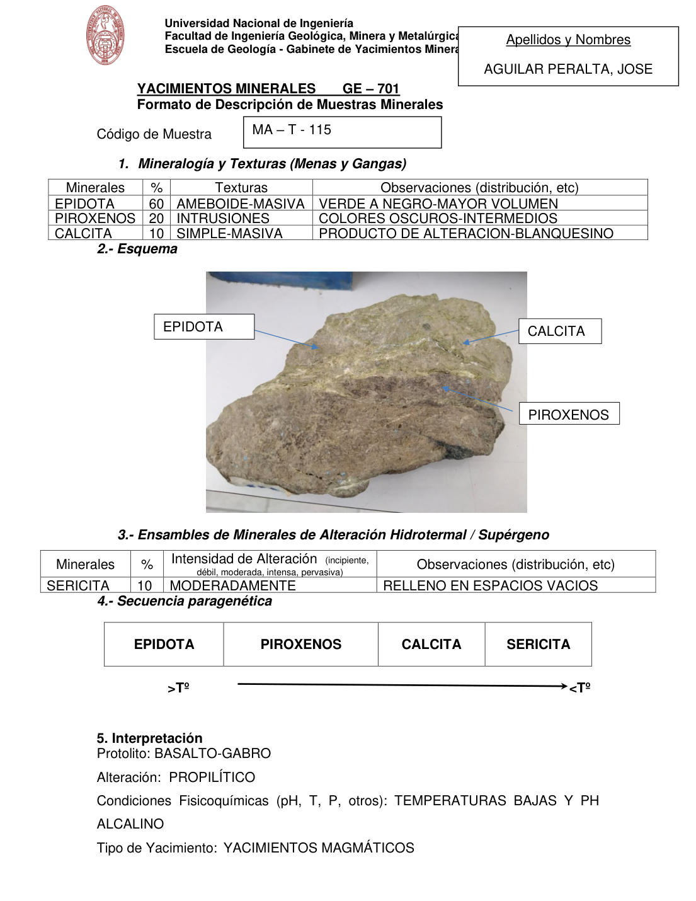

# Muestra MA - T - 115

- **Autor:** Aguilar Peralta, Jose Luis
- **Fuente:** YACIMIENTOS-AGUILAR_PERALTA_JOSE_LUIS.pdf (pagina 6)
- **Confianza transcripcion:** alta

## 1. Mineralogia y Texturas (Menas y Gangas)
| Mineral | % | Texturas | Observaciones |
|---|---|---|---|
| Epidota | 60 | Ameboide-masiva | Verde a negro, mayor volumen |
| Piroxenos | 20 | Intrusiones | Colores oscuros-intermedios |
| Calcita | 10 | Simple-masiva | Producto de alteracion, blanquecino |

## 2. Esquema
Fotografia de la muestra de mano, de tonos verde-pardo. Etiquetas: epidota (masa verdosa), calcita (vetillas blanquecinas) y piroxenos (zonas oscuras).

## 3. Ensambles de Minerales de Alteracion
| Mineral | % | Intensidad | Observaciones |
|---|---|---|---|
| Sericita | 10 | moderada | Relleno en espacios vacios |

## 4. Secuencia paragenetica
De mayor a menor temperatura: epidota, piroxenos, calcita y sericita.
| Mineral / asociacion | Etapa | Notas |
|---|---|---|
| Epidota |  |  |
| Piroxenos |  |  |
| Calcita |  |  |
| Sericita |  |  |

## 5. Interpretacion
- **Protolito:** Basalto-gabro
- **Alteraciones:** Propilitico
- **Condiciones Fisico-Quimicas:** Temperaturas bajas y pH alcalino
- **Tipo de Yacimiento:** Yacimientos magmaticos

> Notas: PDF digital (texto seleccionable), no manuscrito: la transcripcion es literal. El esquema de la seccion 2 es una fotografia de la muestra de mano, no un dibujo. Grupo del informe: A) Yacimientos magmaticos (separador en pagina 2). Los porcentajes de la tabla 1 suman 90 %; se transcribe tal cual. La sericita aparece solo en la tabla de alteracion y en la secuencia paragenetica, no en la tabla 1.
