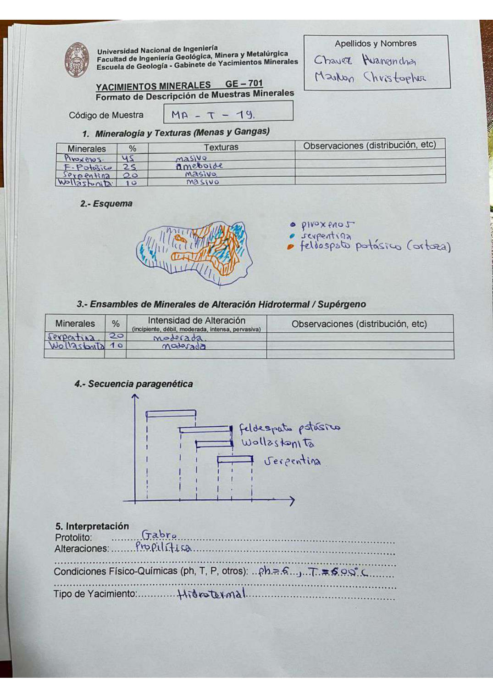

# Muestra MA - T - 19

- **Autor:** Chavez Huamancha, Marlon Christopher
- **Fuente:** MAGMATICOS_MUESTRAS.pdf (pagina 1)
- **Confianza transcripcion:** alta

## 1. Mineralogia y Texturas (Menas y Gangas)
| Mineral | % | Texturas | Observaciones |
|---|---|---|---|
| Piroxenos | 45 | Masivo |  |
| Feldespato potasico | 25 | Ameboide |  |
| Serpentina | 20 | Masivo |  |
| Wollastonita | 10 | Masivo |  |

## 2. Esquema
Dibujo de la muestra con leyenda de colores: piroxenos (azul, trama rayada), serpentina (celeste) y feldespato potasico / ortosa (naranja).

## 3. Ensambles de Minerales de Alteracion
| Mineral | % | Intensidad | Observaciones |
|---|---|---|---|
| Serpentina | 20 | moderada |  |
| Wollastonita | 10 | moderada |  |

## 4. Secuencia paragenetica
Cuatro barras de mayor a menor temperatura; la primera va sin etiquetar (roca caja) y las siguientes son feldespato potasico, wollastonita y serpentina.
| Mineral / asociacion | Etapa | Notas |
|---|---|---|
| Roca caja | roca caja | Barra sin etiquetar en la hoja |
| Feldespato potasico | hidrotermal |  |
| Wollastonita | hidrotermal |  |
| Serpentina | hidrotermal |  |

## 5. Interpretacion
- **Protolito:** Gabro
- **Alteraciones:** Propilitica
- **Condiciones Fisico-Quimicas:** pH = 6; T = 600 C
- **Tipo de Yacimiento:** Hidrotermal

> Notas: Escaneo de hoja manuscrita, leido con vision. Carpeta = codigo saneado, colapsando los espacios alrededor de los guiones (p.ej. 'MA - T - 19' -> MA-T-19). El codigo se lee con claridad como 'MA - T - 19', con T. Es la misma muestra que MA-Y-19 (Minaya Delgado), descrita por otro alumno: mineralogia, protolito (gabro), alteracion propilitica y condiciones casi identicas. Refuerza que la letra central de la serie es T y no Y.
