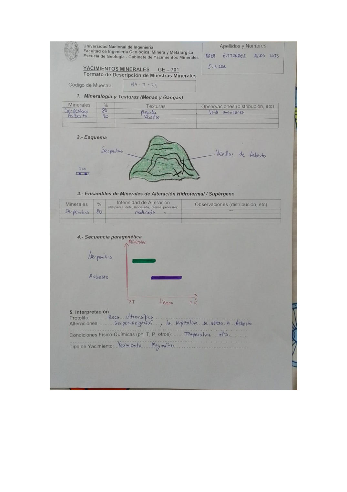

# Muestra MA-T-21

- **Autor:** Daza Gutierrez, Aldo Luis Junior
- **Fuente:** MAGMATICOS.pdf (pagina 3)
- **Confianza transcripcion:** alta

## 1. Mineralogia y Texturas (Menas y Gangas)
| Mineral | % | Texturas | Observaciones |
|---|---|---|---|
| Serpentina | 80 | Plegada | Verde amarillenta |
| Asbesto | 20 | Venillas |  |

## 2. Esquema
Masa verde (serpentina) con textura plegada, cortada por venillas oscuras de asbesto.

_Escala:_ 2 cm

## 3. Ensambles de Minerales de Alteracion
| Mineral | % | Intensidad | Observaciones |
|---|---|---|---|
| Serpentina | 80 | moderada |  |

## 4. Secuencia paragenetica
Serpentina a mayor temperatura y asbesto posterior.
| Mineral / asociacion | Etapa | Notas |
|---|---|---|
| Serpentina | alteracion (serpentinizacion) |  |
| Asbesto | posterior | Rellena venillas |

## 5. Interpretacion
- **Protolito:** Roca ultramafica
- **Alteraciones:** Serpentinizacion; la serpentina se altera a asbesto
- **Condiciones Fisico-Quimicas:** Temperatura alta
- **Tipo de Yacimiento:** Yacimiento Magmatico

> Notas: La letra central del codigo se lee claramente como 'T' en la escritura de este autor (MA-T-NN). Ojo: en MINAYA_DELGADO_STEVEN.pdf el mismo glifo se viene transcribiendo como 'Y' (MA-Y-NN); podrian ser la misma serie de codigos.
