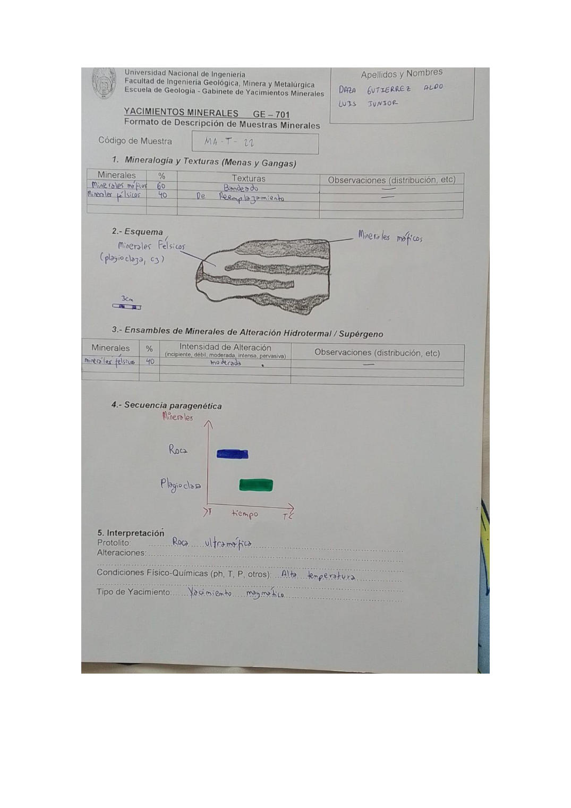

# Muestra MA-T-22

- **Autor:** Daza Gutierrez, Aldo Luis Junior
- **Fuente:** MAGMATICOS.pdf (pagina 2)
- **Confianza transcripcion:** alta

## 1. Mineralogia y Texturas (Menas y Gangas)
| Mineral | % | Texturas | Observaciones |
|---|---|---|---|
| Minerales maficos | 60 | Bandeado |  |
| Minerales felsicos | 40 | De reemplazamiento |  |

## 2. Esquema
Roca alargada con bandeamiento: bandas oscuras de minerales maficos y bandas claras de minerales felsicos (plagioclasa, cuarzo).

_Escala:_ 3 cm

## 3. Ensambles de Minerales de Alteracion
| Mineral | % | Intensidad | Observaciones |
|---|---|---|---|
| Minerales felsicos | 40 | moderada |  |

## 4. Secuencia paragenetica
Roca caja primero y luego plagioclasa.
| Mineral / asociacion | Etapa | Notas |
|---|---|---|
| Roca | roca caja |  |
| Plagioclasa | posterior |  |

## 5. Interpretacion
- **Protolito:** Roca ultramafica
- **Alteraciones:** 
- **Condiciones Fisico-Quimicas:** Alta temperatura
- **Tipo de Yacimiento:** Yacimiento magmatico

> Notas: En el esquema la etiqueta dice '(plagioclasa, cz)'; 'cz' se interpreta como cuarzo. La casilla de Alteraciones (seccion 5) quedo vacia. La letra central del codigo se lee claramente como 'T' en la escritura de este autor (MA-T-NN). Ojo: en MINAYA_DELGADO_STEVEN.pdf el mismo glifo se viene transcribiendo como 'Y' (MA-Y-NN); podrian ser la misma serie de codigos.
