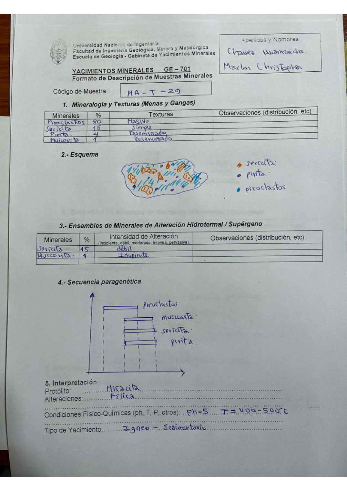

# Muestra MA - T - 29

- **Autor:** Chavez Huamancha, Marlon Christopher
- **Fuente:** MAGMATICOS_MUESTRAS.pdf (pagina 8)
- **Confianza transcripcion:** alta

## 1. Mineralogia y Texturas (Menas y Gangas)
| Mineral | % | Texturas | Observaciones |
|---|---|---|---|
| Piroclastos | 80 | Masivo |  |
| Sericita | 15 | Simple |  |
| Pirita | 4 | Diseminado |  |
| Muscovita | 1 | Diseminado |  |

## 2. Esquema
Dibujo de la muestra con leyenda: sericita (naranja), pirita (azul oscuro, granos pequenos) y piroclastos (celeste).

## 3. Ensambles de Minerales de Alteracion
| Mineral | % | Intensidad | Observaciones |
|---|---|---|---|
| Sericita | 15 | debil |  |
| Muscovita | 1 | incipiente |  |

## 4. Secuencia paragenetica
Piroclastos, luego muscovita, sericita y pirita.
| Mineral / asociacion | Etapa | Notas |
|---|---|---|
| Piroclastos |  |  |
| Muscovita |  |  |
| Sericita |  |  |
| Pirita |  |  |

## 5. Interpretacion
- **Protolito:** Micacita
- **Alteraciones:** Filica
- **Condiciones Fisico-Quimicas:** pH = 5; T = 400-500 C
- **Tipo de Yacimiento:** Ignea - sedimentaria

> Notas: Escaneo de hoja manuscrita, leido con vision. Carpeta = codigo saneado, colapsando los espacios alrededor de los guiones (p.ej. 'MA - T - 19' -> MA-T-19).
