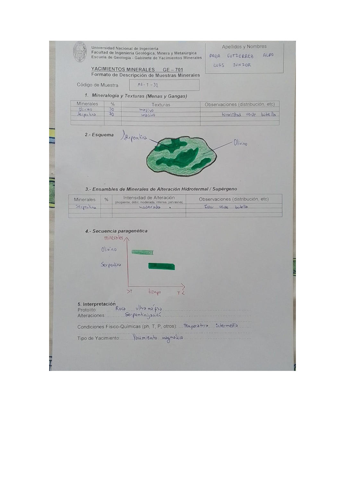

# Muestra MA-T-32

- **Autor:** Daza Gutierrez, Aldo Luis Junior
- **Fuente:** MAGMATICOS.pdf (pagina 6)
- **Confianza transcripcion:** alta

## 1. Mineralogia y Texturas (Menas y Gangas)
| Mineral | % | Texturas | Observaciones |
|---|---|---|---|
| Olivino | 30 | Masivo |  |
| Serpentina | 70 | Masivo | Tonalidad verde botella |

## 2. Esquema
Muestra verde con matriz verde claro y parches de verde oscuro (verde botella) etiquetados como serpentina; las zonas mas claras corresponden a olivino.

## 3. Ensambles de Minerales de Alteracion
| Mineral | % | Intensidad | Observaciones |
|---|---|---|---|
| Serpentina |  | moderada | Color verde botella |

## 4. Secuencia paragenetica
Olivino a mayor temperatura y serpentina posterior.
| Mineral / asociacion | Etapa | Notas |
|---|---|---|
| Olivino | magmatico |  |
| Serpentina | alteracion (serpentinizacion) |  |

## 5. Interpretacion
- **Protolito:** Roca ultramafica
- **Alteraciones:** Serpentinizacion
- **Condiciones Fisico-Quimicas:** Temperatura intermedia
- **Tipo de Yacimiento:** Yacimiento magmatico

> Notas: La hoja no indica escala en el esquema y la celda de % en la tabla 3 quedo vacia. La letra central del codigo se lee claramente como 'T' en la escritura de este autor (MA-T-NN). Ojo: en MINAYA_DELGADO_STEVEN.pdf el mismo glifo se viene transcribiendo como 'Y' (MA-Y-NN); podrian ser la misma serie de codigos.
