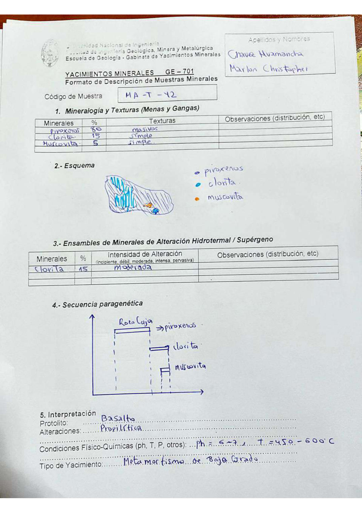

# Muestra MA - T - 42

- **Autor:** Chavez Huamancha, Marlon Christopher
- **Fuente:** MAGMATICOS_MUESTRAS.pdf (pagina 5)
- **Confianza transcripcion:** alta

## 1. Mineralogia y Texturas (Menas y Gangas)
| Mineral | % | Texturas | Observaciones |
|---|---|---|---|
| Piroxenos | 80 | Masivos |  |
| Clorita | 15 | Simple |  |
| Muscovita | 5 | Simple |  |

## 2. Esquema
Dibujo de la muestra con leyenda: piroxenos (azul), clorita (celeste) y muscovita (naranja), estas dos ultimas concentradas en la parte inferior.

## 3. Ensambles de Minerales de Alteracion
| Mineral | % | Intensidad | Observaciones |
|---|---|---|---|
| Clorita | 15 | moderada |  |

## 4. Secuencia paragenetica
Roca caja (piroxenos), luego clorita y finalmente muscovita.
| Mineral / asociacion | Etapa | Notas |
|---|---|---|
| Roca caja | roca caja | Piroxenos |
| Clorita |  |  |
| Muscovita |  |  |

## 5. Interpretacion
- **Protolito:** Basalto
- **Alteraciones:** Propilitica
- **Condiciones Fisico-Quimicas:** pH = 6-7; T = 450-600 C
- **Tipo de Yacimiento:** Metamorfismo de bajo grado

> Notas: Escaneo de hoja manuscrita, leido con vision. Carpeta = codigo saneado, colapsando los espacios alrededor de los guiones (p.ej. 'MA - T - 19' -> MA-T-19).
