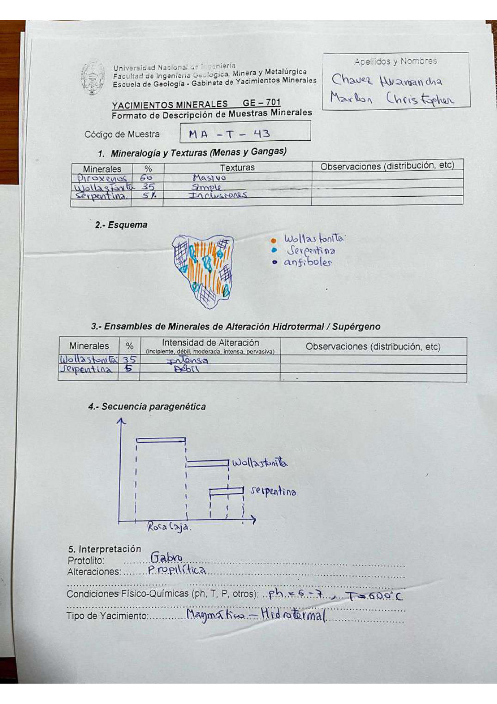

# Muestra MA - T - 43

- **Autor:** Chavez Huamancha, Marlon Christopher
- **Fuente:** MAGMATICOS_MUESTRAS.pdf (pagina 9)
- **Confianza transcripcion:** alta

## 1. Mineralogia y Texturas (Menas y Gangas)
| Mineral | % | Texturas | Observaciones |
|---|---|---|---|
| Piroxenos | 60 | Masivo |  |
| Wollastonita | 35 | Simple |  |
| Serpentina | 5 | Inclusiones |  |

## 2. Esquema
Dibujo de la muestra con leyenda: wollastonita (naranja, en cristales alargados), serpentina (celeste) y anfiboles (azul oscuro).

## 3. Ensambles de Minerales de Alteracion
| Mineral | % | Intensidad | Observaciones |
|---|---|---|---|
| Wollastonita | 35 | intensa |  |
| Serpentina | 5 | debil |  |

## 4. Secuencia paragenetica
Roca caja, luego wollastonita y finalmente serpentina.
| Mineral / asociacion | Etapa | Notas |
|---|---|---|
| Roca caja | roca caja |  |
| Wollastonita |  |  |
| Serpentina |  |  |

## 5. Interpretacion
- **Protolito:** Gabro
- **Alteraciones:** Propilitica
- **Condiciones Fisico-Quimicas:** pH = 6-7; T = 600 C
- **Tipo de Yacimiento:** Magmatico - hidrotermal

> Notas: Escaneo de hoja manuscrita, leido con vision. Carpeta = codigo saneado, colapsando los espacios alrededor de los guiones (p.ej. 'MA - T - 19' -> MA-T-19). La serpentina figura como '5 %' en la tabla 1.
