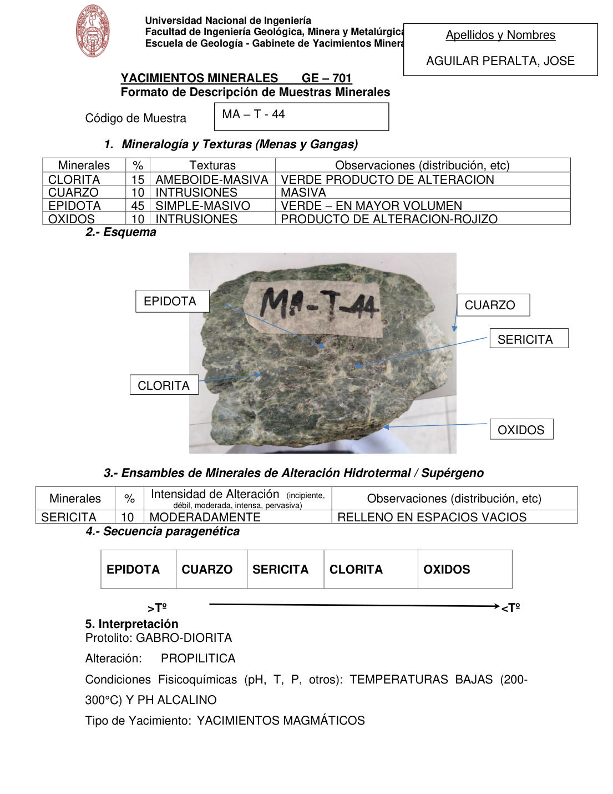

# Muestra MA - T - 44

- **Autor:** Aguilar Peralta, Jose Luis
- **Fuente:** YACIMIENTOS-AGUILAR_PERALTA_JOSE_LUIS.pdf (pagina 7)
- **Confianza transcripcion:** alta

## 1. Mineralogia y Texturas (Menas y Gangas)
| Mineral | % | Texturas | Observaciones |
|---|---|---|---|
| Clorita | 15 | Ameboide-masiva | Verde, producto de alteracion |
| Cuarzo | 10 | Intrusiones | Masiva |
| Epidota | 45 | Simple-masivo | Verde, en mayor volumen |
| Oxidos | 10 | Intrusiones | Producto de alteracion, rojizo |

## 2. Esquema
Fotografia de la muestra de mano con rotulo 'MA-T-44'. Roca verde con epidota y clorita, vetillas claras de cuarzo y sericita, y oxidos rojizos en el borde inferior.

## 3. Ensambles de Minerales de Alteracion
| Mineral | % | Intensidad | Observaciones |
|---|---|---|---|
| Sericita | 10 | moderada | Relleno en espacios vacios |

## 4. Secuencia paragenetica
De mayor a menor temperatura: epidota, cuarzo, sericita, clorita y oxidos.
| Mineral / asociacion | Etapa | Notas |
|---|---|---|
| Epidota |  |  |
| Cuarzo |  |  |
| Sericita |  |  |
| Clorita |  |  |
| Oxidos |  |  |

## 5. Interpretacion
- **Protolito:** Gabro-diorita
- **Alteraciones:** Propilitica
- **Condiciones Fisico-Quimicas:** Temperaturas bajas (200-300 C) y pH alcalino
- **Tipo de Yacimiento:** Yacimientos magmaticos

> Notas: PDF digital (texto seleccionable), no manuscrito: la transcripcion es literal. El esquema de la seccion 2 es una fotografia de la muestra de mano, no un dibujo. Grupo del informe: A) Yacimientos magmaticos (separador en pagina 2). Los porcentajes de la tabla 1 suman 80 %; se transcribe tal cual.
