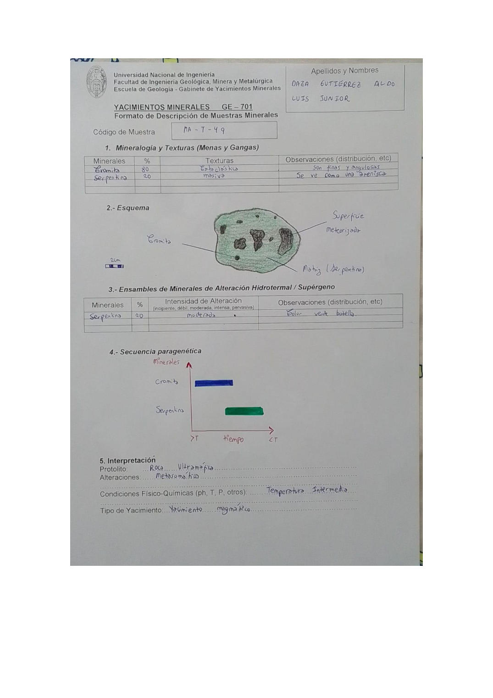

# Muestra MA-T-49

- **Autor:** Daza Gutierrez, Aldo Luis Junior
- **Fuente:** MAGMATICOS.pdf (pagina 8)
- **Confianza transcripcion:** alta

## 1. Mineralogia y Texturas (Menas y Gangas)
| Mineral | % | Texturas | Observaciones |
|---|---|---|---|
| Cromita | 80 | Cataclastica | Son finas y angulosas |
| Serpentina | 20 | Masiva | Se ve como una arenisca |

## 2. Esquema
Muestra con matriz verde de serpentina y fragmentos oscuros angulosos de cromita; superficie meteorizada.

_Escala:_ 2 cm

## 3. Ensambles de Minerales de Alteracion
| Mineral | % | Intensidad | Observaciones |
|---|---|---|---|
| Serpentina | 20 | moderada | Color verde botella |

## 4. Secuencia paragenetica
Cromita primero y serpentina despues.
| Mineral / asociacion | Etapa | Notas |
|---|---|---|
| Cromita | magmatico |  |
| Serpentina | alteracion (serpentinizacion) |  |

## 5. Interpretacion
- **Protolito:** Roca ultramafica
- **Alteraciones:** Metasomatico
- **Condiciones Fisico-Quimicas:** Temperatura intermedia
- **Tipo de Yacimiento:** Yacimiento magmatico

> Notas: La letra central del codigo se lee claramente como 'T' en la escritura de este autor (MA-T-NN). Ojo: en MINAYA_DELGADO_STEVEN.pdf el mismo glifo se viene transcribiendo como 'Y' (MA-Y-NN); podrian ser la misma serie de codigos.
