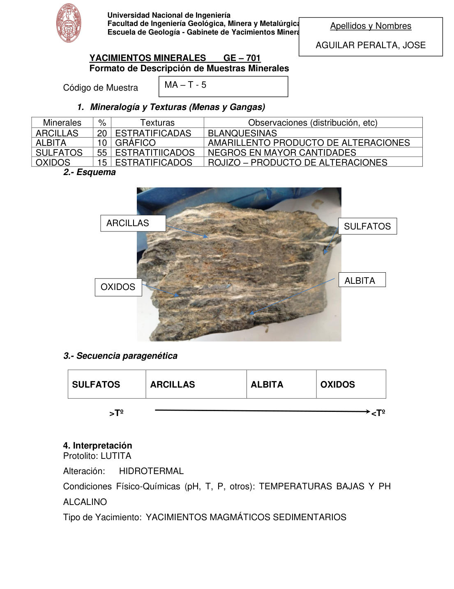

# Muestra MA - T - 5

- **Autor:** Aguilar Peralta, Jose Luis
- **Fuente:** YACIMIENTOS-AGUILAR_PERALTA_JOSE_LUIS.pdf (pagina 3)
- **Confianza transcripcion:** alta

## 1. Mineralogia y Texturas (Menas y Gangas)
| Mineral | % | Texturas | Observaciones |
|---|---|---|---|
| Arcillas | 20 | Estratificadas | Blanquecinas |
| Albita | 10 | Grafico | Amarillento, producto de alteraciones |
| Sulfatos | 55 | Estratificados | Negros, en mayor cantidad |
| Oxidos | 15 | Estratificados | Rojizo, producto de alteraciones |

## 2. Esquema
Fotografia de la muestra de mano, de aspecto bandeado/estratificado, con etiquetas: arcillas (bandas blanquecinas), sulfatos (bandas oscuras, borde derecho), albita (zona inferior derecha) y oxidos (zona rojiza inferior izquierda).

## 3. Ensambles de Minerales de Alteracion

## 4. Secuencia paragenetica
De mayor a menor temperatura: sulfatos, arcillas, albita y oxidos.
| Mineral / asociacion | Etapa | Notas |
|---|---|---|
| Sulfatos |  |  |
| Arcillas |  |  |
| Albita |  |  |
| Oxidos |  |  |

## 5. Interpretacion
- **Protolito:** Lutita
- **Alteraciones:** Hidrotermal
- **Condiciones Fisico-Quimicas:** Temperaturas bajas y pH alcalino
- **Tipo de Yacimiento:** Yacimientos magmaticos sedimentarios

> Notas: PDF digital (texto seleccionable), no manuscrito: la transcripcion es literal. El esquema de la seccion 2 es una fotografia de la muestra de mano, no un dibujo. Grupo del informe: A) Yacimientos magmaticos (separador en pagina 2). ATENCION: esta hoja trae el mismo codigo 'MA - T - 5' que la de la pagina 5, pero describe una muestra distinta y su foto no muestra etiqueta de codigo; probablemente sea un codigo arrastrado de la hoja anterior. Se guarda en la carpeta MA-T-5-b para no colisionar con la pagina 5, cuya foto si muestra el rotulo 'MA-T-5'. Esta hoja NO incluye la seccion de ensambles de alteracion: sus secciones son 1 Mineralogia, 2 Esquema, 3 Secuencia paragenetica y 4 Interpretacion.
