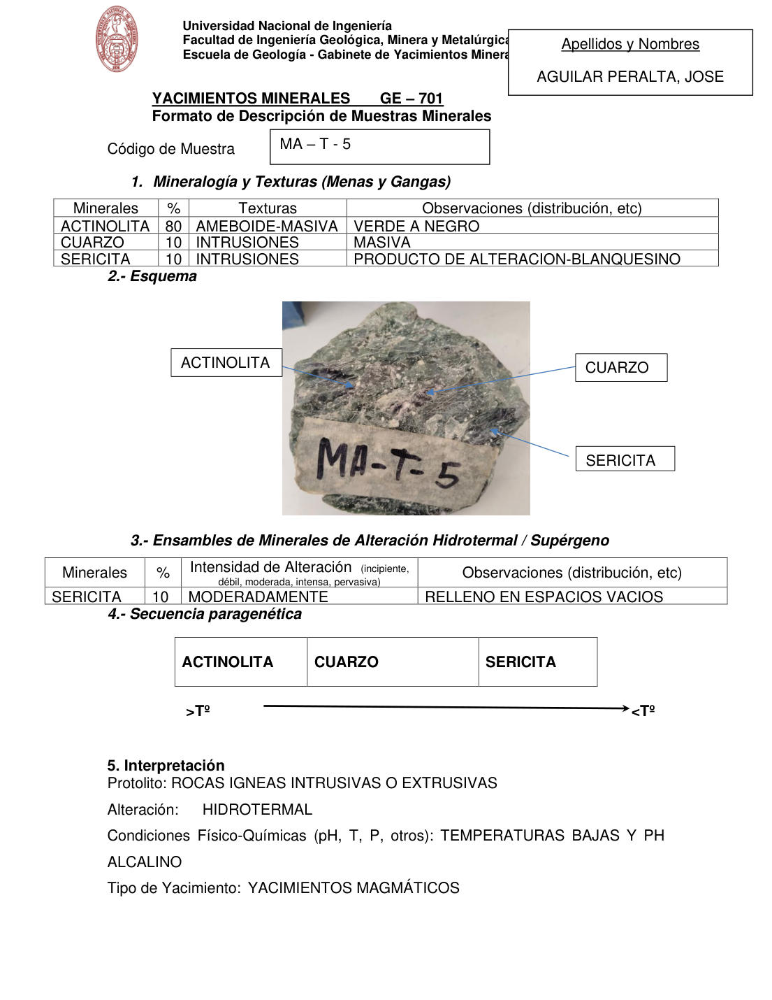

# Muestra MA - T - 5

- **Autor:** Aguilar Peralta, Jose Luis
- **Fuente:** YACIMIENTOS-AGUILAR_PERALTA_JOSE_LUIS.pdf (pagina 5)
- **Confianza transcripcion:** alta

## 1. Mineralogia y Texturas (Menas y Gangas)
| Mineral | % | Texturas | Observaciones |
|---|---|---|---|
| Actinolita | 80 | Ameboide-masiva | Verde a negro |
| Cuarzo | 10 | Intrusiones | Masiva |
| Sericita | 10 | Intrusiones | Producto de alteracion, blanquecino |

## 2. Esquema
Fotografia de la muestra de mano con rotulo 'MA-T-5'. Masa verde oscura de actinolita con parches claros de cuarzo y sericita blanquecina en los bordes.

## 3. Ensambles de Minerales de Alteracion
| Mineral | % | Intensidad | Observaciones |
|---|---|---|---|
| Sericita | 10 | moderada | Relleno en espacios vacios |

## 4. Secuencia paragenetica
De mayor a menor temperatura: actinolita, cuarzo y sericita.
| Mineral / asociacion | Etapa | Notas |
|---|---|---|
| Actinolita |  |  |
| Cuarzo |  |  |
| Sericita |  |  |

## 5. Interpretacion
- **Protolito:** Rocas igneas intrusivas o extrusivas
- **Alteraciones:** Hidrotermal
- **Condiciones Fisico-Quimicas:** Temperaturas bajas y pH alcalino
- **Tipo de Yacimiento:** Yacimientos magmaticos

> Notas: PDF digital (texto seleccionable), no manuscrito: la transcripcion es literal. El esquema de la seccion 2 es una fotografia de la muestra de mano, no un dibujo. Grupo del informe: A) Yacimientos magmaticos (separador en pagina 2). El codigo esta confirmado por el rotulo de la foto ('MA-T-5'). La hoja de la pagina 3 repite este mismo codigo; ver MA-T-5-b. La intensidad figura como 'MODERADAMENTE'.
