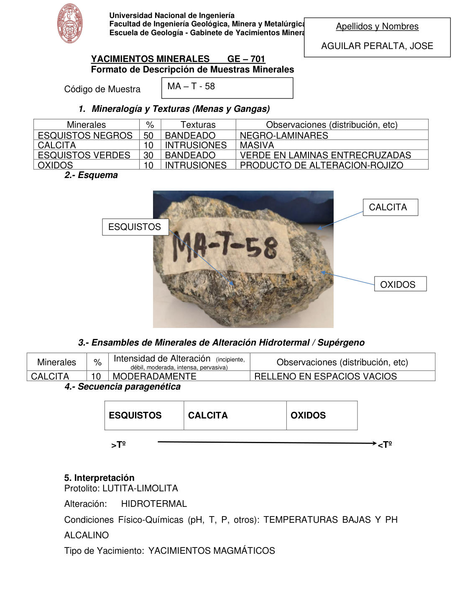

# Muestra MA - T - 58

- **Autor:** Aguilar Peralta, Jose Luis
- **Fuente:** YACIMIENTOS-AGUILAR_PERALTA_JOSE_LUIS.pdf (pagina 9)
- **Confianza transcripcion:** alta

## 1. Mineralogia y Texturas (Menas y Gangas)
| Mineral | % | Texturas | Observaciones |
|---|---|---|---|
| Esquistos negros | 50 | Bandeado | Negro, laminares |
| Calcita | 10 | Intrusiones | Masiva |
| Esquistos verdes | 30 | Bandeado | Verde, en laminas entrecruzadas |
| Oxidos | 10 | Intrusiones | Producto de alteracion, rojizo |

## 2. Esquema
Fotografia de la muestra de mano con rotulo 'MA-T-58'. Roca bandeada gris-negra (esquistos) con calcita blanquecina y oxidos pardo-rojizos.

## 3. Ensambles de Minerales de Alteracion
| Mineral | % | Intensidad | Observaciones |
|---|---|---|---|
| Calcita | 10 | moderada | Relleno en espacios vacios |

## 4. Secuencia paragenetica
De mayor a menor temperatura: esquistos, calcita y oxidos.
| Mineral / asociacion | Etapa | Notas |
|---|---|---|
| Esquistos |  |  |
| Calcita |  |  |
| Oxidos |  |  |

## 5. Interpretacion
- **Protolito:** Lutita-limolita
- **Alteraciones:** Hidrotermal
- **Condiciones Fisico-Quimicas:** Temperaturas bajas y pH alcalino
- **Tipo de Yacimiento:** Yacimientos magmaticos

> Notas: PDF digital (texto seleccionable), no manuscrito: la transcripcion es literal. El esquema de la seccion 2 es una fotografia de la muestra de mano, no un dibujo. Grupo del informe: A) Yacimientos magmaticos (separador en pagina 2). La intensidad figura como 'MODERADAMENTE'.
