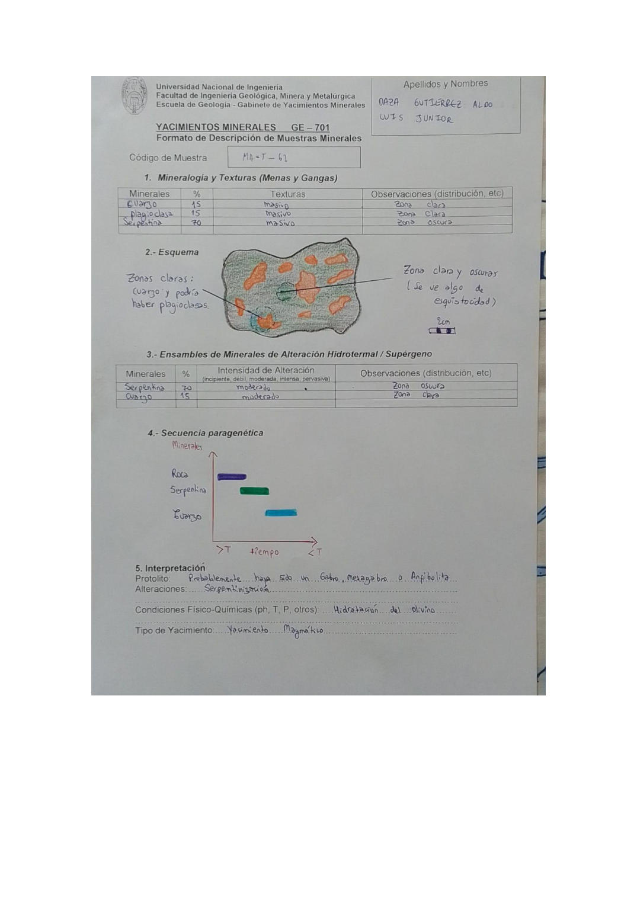

# Muestra MA-T-62

- **Autor:** Daza Gutierrez, Aldo Luis Junior
- **Fuente:** MAGMATICOS.pdf (pagina 9)
- **Confianza transcripcion:** alta

## 1. Mineralogia y Texturas (Menas y Gangas)
| Mineral | % | Texturas | Observaciones |
|---|---|---|---|
| Cuarzo | 15 | Masivo | Zona clara |
| Plagioclasa | 15 | Masivo | Zona clara |
| Serpentina | 70 | Masivo | Zona oscura |

## 2. Esquema
Muestra con fondo verde grisaceo (zonas oscuras de serpentina) y manchas anaranjadas alargadas (zonas claras: cuarzo y posiblemente plagioclasas); se aprecia algo de esquistosidad.

_Escala:_ 2 cm

## 3. Ensambles de Minerales de Alteracion
| Mineral | % | Intensidad | Observaciones |
|---|---|---|---|
| Serpentina | 70 | moderada | Zona oscura |
| Cuarzo | 15 | moderada | Zona clara |

## 4. Secuencia paragenetica
Roca caja, luego serpentina y finalmente cuarzo.
| Mineral / asociacion | Etapa | Notas |
|---|---|---|
| Roca | roca caja |  |
| Serpentina | alteracion (serpentinizacion) |  |
| Cuarzo | posterior |  |

## 5. Interpretacion
- **Protolito:** Probablemente haya sido un Gabro, Metagabro o Anfibolita
- **Alteraciones:** Serpentinizacion
- **Condiciones Fisico-Quimicas:** Hidratacion del Olivino
- **Tipo de Yacimiento:** Yacimiento Magmatico

> Notas: La letra central del codigo se lee claramente como 'T' en la escritura de este autor (MA-T-NN). Ojo: en MINAYA_DELGADO_STEVEN.pdf el mismo glifo se viene transcribiendo como 'Y' (MA-Y-NN); podrian ser la misma serie de codigos.
