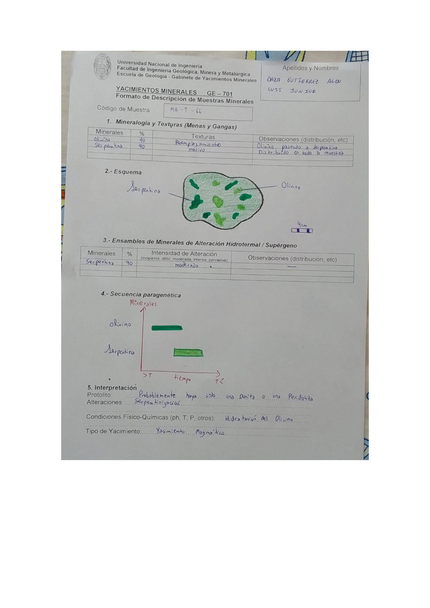

# Muestra MA-T-66

- **Autor:** Daza Gutierrez, Aldo Luis Junior
- **Fuente:** MAGMATICOS.pdf (pagina 1)
- **Confianza transcripcion:** alta

## 1. Mineralogia y Texturas (Menas y Gangas)
| Mineral | % | Texturas | Observaciones |
|---|---|---|---|
| Olivino | 10 | Reemplazamiento | Olivino pasando a serpentina |
| Serpentina | 90 | Masivo | Distribuido en toda la muestra |

## 2. Esquema
Muestra de contorno irregular con matriz verde claro (serpentina) y manchas de verde oscuro a verde amarillento senaladas como olivino (relictos).

_Escala:_ 4 cm

## 3. Ensambles de Minerales de Alteracion
| Mineral | % | Intensidad | Observaciones |
|---|---|---|---|
| Serpentina | 90 | moderada |  |

## 4. Secuencia paragenetica
Olivino a mayor temperatura, seguido por serpentina al descender la temperatura.
| Mineral / asociacion | Etapa | Notas |
|---|---|---|
| Olivino | magmatico | Barra a mayor T |
| Serpentina | alteracion (serpentinizacion) | Barra a menor T |

## 5. Interpretacion
- **Protolito:** Probablemente haya sido una Dunita o una Peridotita
- **Alteraciones:** Serpentinizacion
- **Condiciones Fisico-Quimicas:** Hidratacion del Olivino
- **Tipo de Yacimiento:** Yacimiento Magmatico

> Notas: En la tabla 1 la columna Texturas trae 'Reemplazamiento' y 'masivo' escritos a caballo entre las dos filas; se asignan a Olivino y Serpentina respectivamente. La letra central del codigo se lee claramente como 'T' en la escritura de este autor (MA-T-NN). Ojo: en MINAYA_DELGADO_STEVEN.pdf el mismo glifo se viene transcribiendo como 'Y' (MA-Y-NN); podrian ser la misma serie de codigos.
