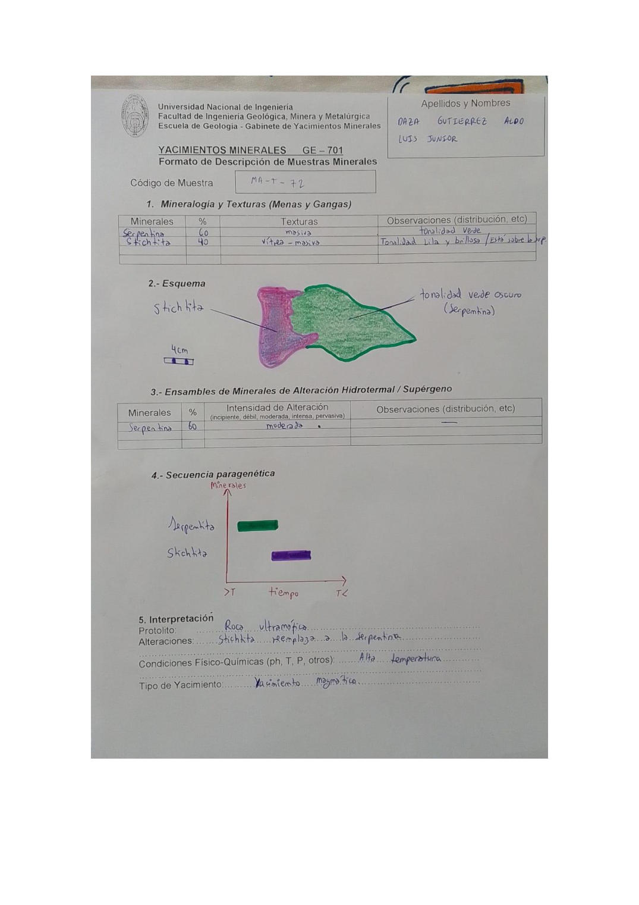

# Muestra MA-T-72

- **Autor:** Daza Gutierrez, Aldo Luis Junior
- **Fuente:** MAGMATICOS.pdf (pagina 4)
- **Confianza transcripcion:** alta

## 1. Mineralogia y Texturas (Menas y Gangas)
| Mineral | % | Texturas | Observaciones |
|---|---|---|---|
| Serpentina | 60 | Masiva | Tonalidad verde |
| Stichtita | 40 | Vitrea - masiva | Tonalidad lila y brillosa; esta sobre la serpentina |

## 2. Esquema
Muestra con dos dominios: zona verde oscuro (serpentina) a la derecha y zona lila/rosada (stichtita) a la izquierda, sobreimpuesta a la serpentina.

_Escala:_ 4 cm

## 3. Ensambles de Minerales de Alteracion
| Mineral | % | Intensidad | Observaciones |
|---|---|---|---|
| Serpentina | 60 | moderada |  |

## 4. Secuencia paragenetica
Serpentina primero (mayor T) y stichtita despues.
| Mineral / asociacion | Etapa | Notas |
|---|---|---|
| Serpentina | alteracion (serpentinizacion) |  |
| Stichtita | posterior | Reemplaza a la serpentina |

## 5. Interpretacion
- **Protolito:** Roca ultramafica
- **Alteraciones:** Stichtita reemplaza a la serpentina
- **Condiciones Fisico-Quimicas:** Alta temperatura
- **Tipo de Yacimiento:** Yacimiento magmatico

> Notas: La letra central del codigo se lee claramente como 'T' en la escritura de este autor (MA-T-NN). Ojo: en MINAYA_DELGADO_STEVEN.pdf el mismo glifo se viene transcribiendo como 'Y' (MA-Y-NN); podrian ser la misma serie de codigos.
