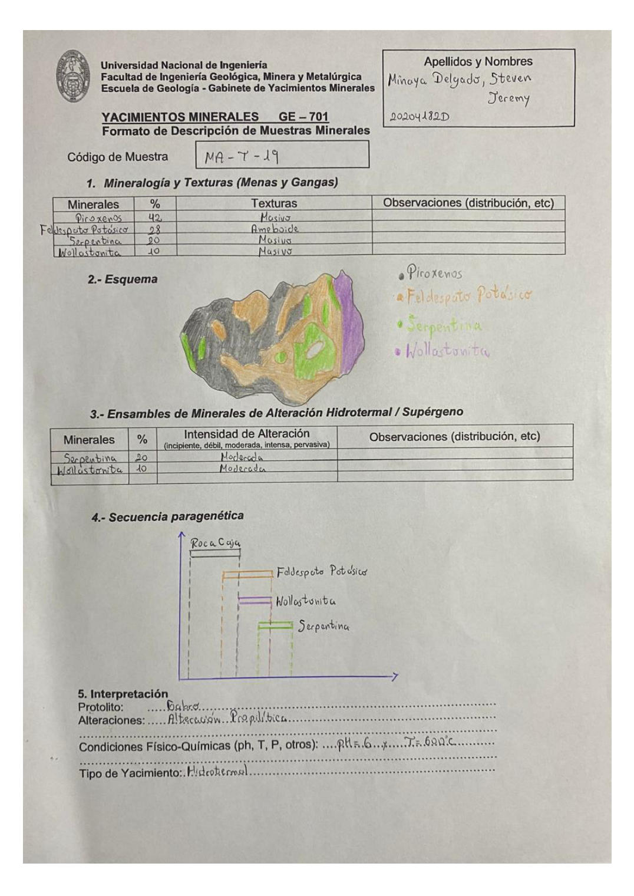

# Muestra MA-Y-19

- **Autor:** Minaya Delgado, Steven Jeremy (20204182D)
- **Fuente:** MINAYA_DELGADO_STEVEN.pdf (pagina 2)
- **Confianza transcripcion:** alta

## 1. Mineralogia y Texturas (Menas y Gangas)
| Mineral | % | Texturas | Observaciones |
|---|---|---|---|
| Piroxenos | 42 | Masivo |  |
| Feldespato Potasico | 28 | Ameboide |  |
| Serpentina | 20 | Masivo |  |
| Wollastonita | 10 | Masivo |  |

## 2. Esquema
Dibujo de la muestra con Piroxenos (gris), Feldespato Potasico (naranja), Serpentina (verde) y Wollastonita (morado).

## 3. Ensambles de Minerales de Alteracion
| Mineral | % | Intensidad | Observaciones |
|---|---|---|---|
| Serpentina | 20 | moderada |  |
| Wollastonita | 10 | moderada |  |

## 4. Secuencia paragenetica
Roca caja seguida de Feldespato Potasico, Wollastonita y Serpentina.
| Mineral / asociacion | Etapa | Notas |
|---|---|---|
| Roca Caja | roca caja |  |
| Feldespato Potasico | hidrotermal |  |
| Wollastonita | hidrotermal |  |
| Serpentina | hidrotermal |  |

## 5. Interpretacion
- **Protolito:** Gabro
- **Alteraciones:** Alteracion propilitica
- **Condiciones Fisico-Quimicas:** pH = 6 ; T = 620 C
- **Tipo de Yacimiento:** Hidrotermal

> Notas: La letra central del codigo (MA-?-19) es ambigua en el escaneo; se transcribe como 'Y'.
