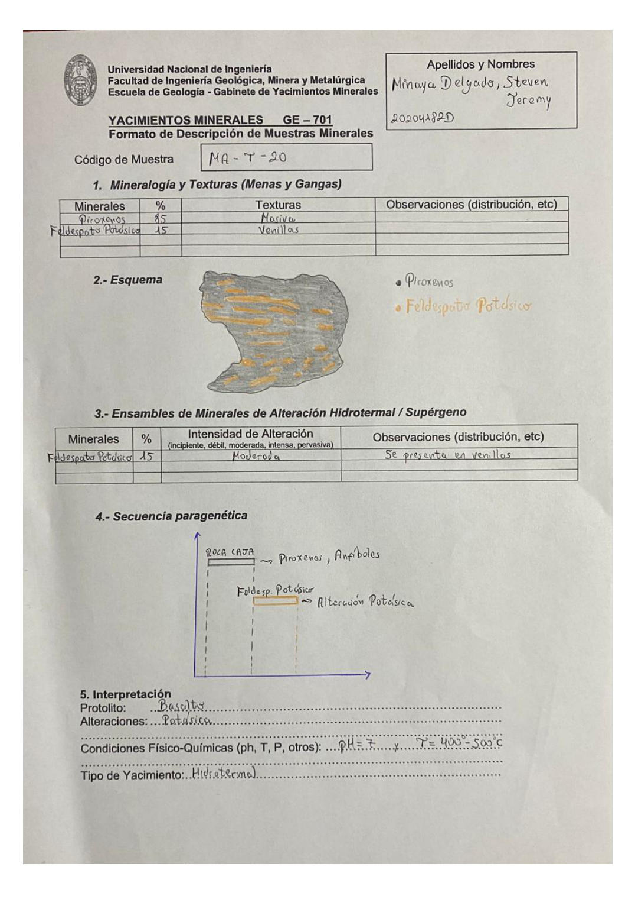

# Muestra MA-Y-20

- **Autor:** Minaya Delgado, Steven Jeremy (20204182D)
- **Fuente:** MINAYA_DELGADO_STEVEN.pdf (pagina 3)
- **Confianza transcripcion:** alta

## 1. Mineralogia y Texturas (Menas y Gangas)
| Mineral | % | Texturas | Observaciones |
|---|---|---|---|
| Piroxenos | 85 | Masiva |  |
| Feldespato Potasico | 15 | Venillas |  |

## 2. Esquema
Muestra gris (Piroxenos) cortada por venillas naranjas de Feldespato Potasico.

## 3. Ensambles de Minerales de Alteracion
| Mineral | % | Intensidad | Observaciones |
|---|---|---|---|
| Feldespato Potasico | 15 | moderada | Se presenta en venillas |

## 4. Secuencia paragenetica
Roca caja (Piroxenos, Anfiboles) seguida de Feldespato Potasico por alteracion potasica.
| Mineral / asociacion | Etapa | Notas |
|---|---|---|
| Piroxenos, Anfiboles | roca caja |  |
| Feldespato Potasico | hidrotermal | Alteracion potasica |

## 5. Interpretacion
- **Protolito:** Basalto
- **Alteraciones:** Potasica
- **Condiciones Fisico-Quimicas:** pH = 7 ; T = 400-500 C
- **Tipo de Yacimiento:** Hidrotermal

> Notas: Letra central del codigo ambigua; se transcribe como 'Y'.
