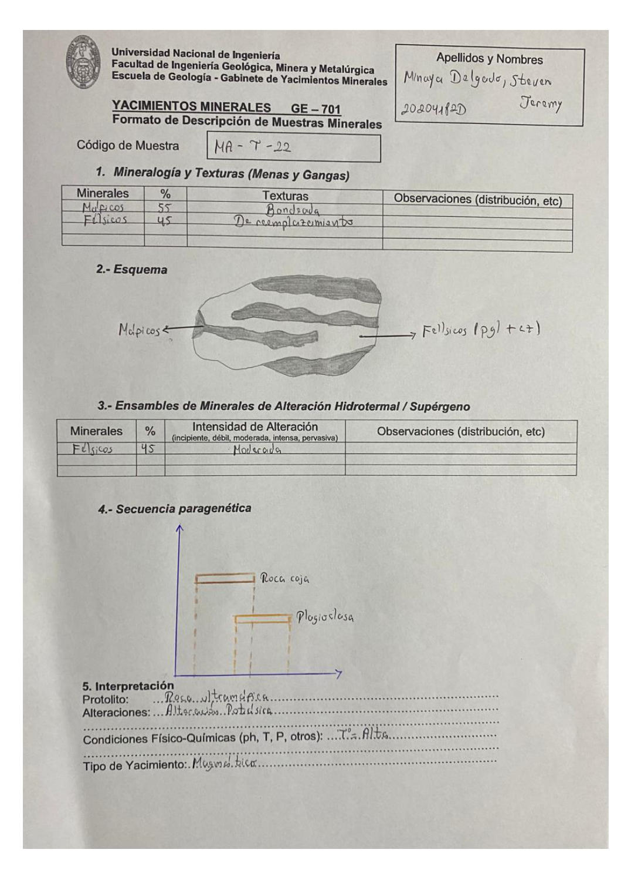

# Muestra MA-Y-22

- **Autor:** Minaya Delgado, Steven Jeremy (20204182D)
- **Fuente:** MINAYA_DELGADO_STEVEN.pdf (pagina 4)
- **Confianza transcripcion:** alta

## 1. Mineralogia y Texturas (Menas y Gangas)
| Mineral | % | Texturas | Observaciones |
|---|---|---|---|
| Maficos | 55 | Bandeada |  |
| Felsicos | 45 | De reemplazamiento | Plagioclasa + cuarzo (pgl + cz) |

## 2. Esquema
Textura bandeada: bandas de minerales maficos (oscuras) y felsicos (plagioclasa + cuarzo).

## 3. Ensambles de Minerales de Alteracion
| Mineral | % | Intensidad | Observaciones |
|---|---|---|---|
| Felsicos | 45 | moderada |  |

## 4. Secuencia paragenetica
Roca caja seguida de Plagioclasa.
| Mineral / asociacion | Etapa | Notas |
|---|---|---|
| Roca caja | roca caja |  |
| Plagioclasa | hidrotermal |  |

## 5. Interpretacion
- **Protolito:** Roca ultramafica
- **Alteraciones:** Alteracion potasica
- **Condiciones Fisico-Quimicas:** T alta
- **Tipo de Yacimiento:** Magmatico

> Notas: Letra central del codigo ambigua; se transcribe como 'Y'. Codigo lee 'MA-Y-22'.
