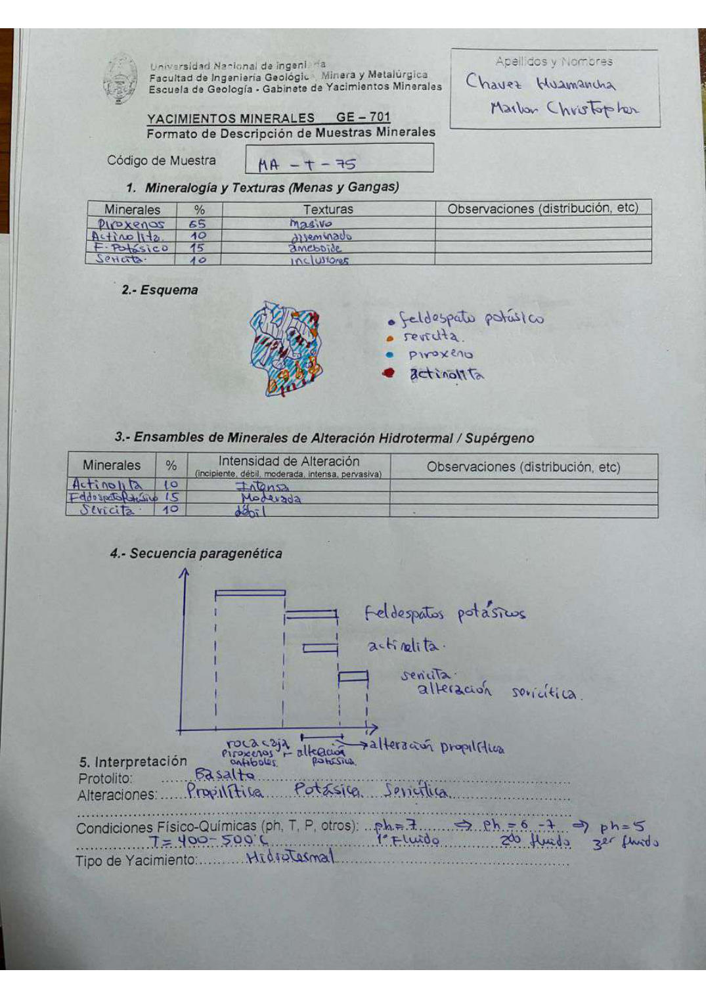

# Muestra MA - t - 75

- **Autor:** Chavez Huamancha, Marlon Christopher
- **Fuente:** MAGMATICOS_MUESTRAS.pdf (pagina 7)
- **Confianza transcripcion:** alta

## 1. Mineralogia y Texturas (Menas y Gangas)
| Mineral | % | Texturas | Observaciones |
|---|---|---|---|
| Piroxenos | 65 | Masivo |  |
| Actinolita | 10 | Diseminado |  |
| Feldespato potasico | 15 | Ameboide |  |
| Sericita | 10 | Inclusiones |  |

## 2. Esquema
Dibujo de la muestra con leyenda de cuatro colores: feldespato potasico (azul oscuro), sericita (naranja), piroxeno (celeste) y actinolita (rojo).

## 3. Ensambles de Minerales de Alteracion
| Mineral | % | Intensidad | Observaciones |
|---|---|---|---|
| Actinolita | 10 | intensa |  |
| Feldespato potasico | 15 | moderada |  |
| Sericita | 10 | debil |  |

## 4. Secuencia paragenetica
Roca caja (piroxenos, anfiboles), luego alteracion potasica (feldespatos potasicos) y alteracion propilitica (actinolita), y por ultimo sericita (alteracion sericitica).
| Mineral / asociacion | Etapa | Notas |
|---|---|---|
| Roca caja | roca caja | Piroxenos, anfiboles |
| Feldespatos potasicos | alteracion potasica |  |
| Actinolita | alteracion propilitica |  |
| Sericita | alteracion sericitica |  |

## 5. Interpretacion
- **Protolito:** Basalto
- **Alteraciones:** Propilitica, potasica, sericitica
- **Condiciones Fisico-Quimicas:** T = 400-500 C; pH = 7 (1er fluido) -> pH = 6-7 (2do fluido) -> pH = 5 (3er fluido)
- **Tipo de Yacimiento:** Hidrotermal

> Notas: Escaneo de hoja manuscrita, leido con vision. Carpeta = codigo saneado, colapsando los espacios alrededor de los guiones (p.ej. 'MA - T - 19' -> MA-T-19). En el codigo la letra central va en minuscula: 'MA - t - 75'.
