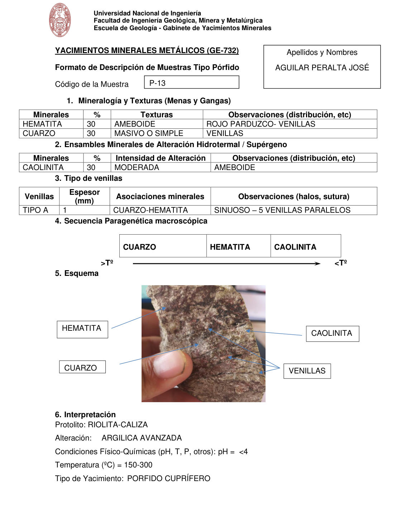

# Muestra P-13

- **Autor:** Aguilar Peralta, Jose Luis
- **Formato:** GE-732 Tipo Porfido
- **Fuente:** YACIMIENTOS-AGUILAR_PERALTA_JOSE_LUIS.pdf (pagina 14)
- **Confianza transcripcion:** alta

## 1. Mineralogia y Texturas (Menas y Gangas)
| Mineral | % | Texturas | Observaciones |
|---|---|---|---|
| Hematita | 30 | Ameboide | Rojo parduzco, venillas |
| Cuarzo | 30 | Masivo o simple | Venillas |

## 2. Esquema
Fotografia de la muestra de mano, pardo-rojiza. Etiquetas: hematita, cuarzo, caolinita y venillas (varias, sinuosas y paralelas).

## 3. Ensambles de Minerales de Alteracion
| Mineral | % | Intensidad | Observaciones |
|---|---|---|---|
| Caolinita | 30 | moderada | Ameboide |

## Tipo de venillas
| Venilla | Espesor (mm) | Asociaciones minerales | Observaciones |
|---|---|---|---|
| Tipo A | 1 | Cuarzo-hematita | Sinuoso; 5 venillas paralelas |

## 4. Secuencia paragenetica
De mayor a menor temperatura: cuarzo, hematita y caolinita.
| Mineral / asociacion | Etapa | Notas |
|---|---|---|
| Cuarzo |  |  |
| Hematita |  |  |
| Caolinita |  |  |

## 5. Interpretacion
- **Protolito:** Riolita-caliza
- **Alteraciones:** Argilica avanzada
- **Condiciones Fisico-Quimicas:** pH < 4; Temperatura = 150-300 C
- **Tipo de Yacimiento:** Porfido cuprifero

> Notas: PDF digital (texto seleccionable), no manuscrito: la transcripcion es literal. Hoja del formato 'YACIMIENTOS MINERALES METALICOS (GE-732) - Formato de Descripcion de Muestras Tipo Porfido', que ademas del GE-701 trae una seccion 'Tipo de venillas' (campo venillas). El esquema es una fotografia de la muestra de mano. Grupo del informe: B) Yacimientos tipo porfidos (separador en pagina 10).
