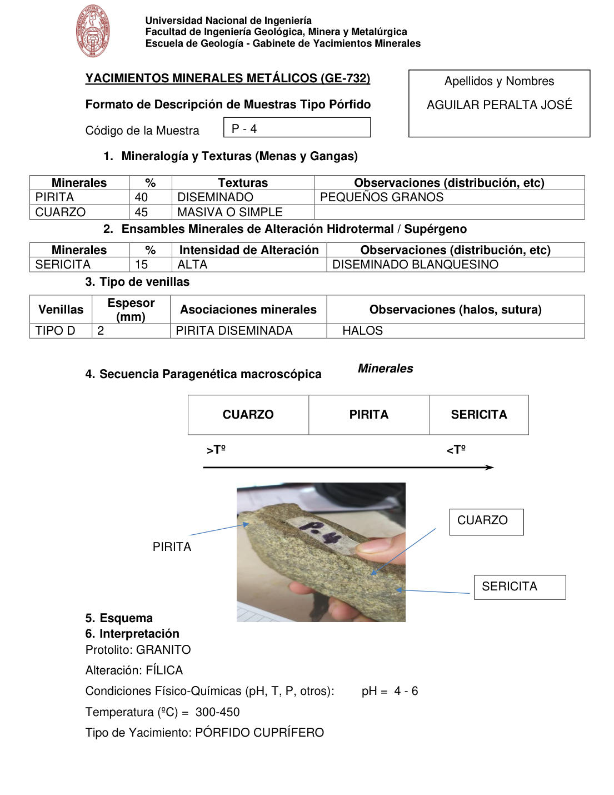

# Muestra P - 4

- **Autor:** Aguilar Peralta, Jose Luis
- **Formato:** GE-732 Tipo Porfido
- **Fuente:** YACIMIENTOS-AGUILAR_PERALTA_JOSE_LUIS.pdf (pagina 13)
- **Confianza transcripcion:** alta

## 1. Mineralogia y Texturas (Menas y Gangas)
| Mineral | % | Texturas | Observaciones |
|---|---|---|---|
| Pirita | 40 | Diseminado | Pequenos granos |
| Cuarzo | 45 | Masiva o simple |  |

## 2. Esquema
Fotografia de la muestra de mano con rotulo 'P-4', de tono verde-pardo. Etiquetas: pirita (borde superior izquierdo), cuarzo y sericita.

## 3. Ensambles de Minerales de Alteracion
| Mineral | % | Intensidad | Observaciones |
|---|---|---|---|
| Sericita | 15 | alta | Diseminado blanquecino |

## Tipo de venillas
| Venilla | Espesor (mm) | Asociaciones minerales | Observaciones |
|---|---|---|---|
| Tipo D | 2 | Pirita diseminada | Halos |

## 4. Secuencia paragenetica
De mayor a menor temperatura: cuarzo, pirita y sericita.
| Mineral / asociacion | Etapa | Notas |
|---|---|---|
| Cuarzo |  |  |
| Pirita |  |  |
| Sericita |  |  |

## 5. Interpretacion
- **Protolito:** Granito
- **Alteraciones:** Filica
- **Condiciones Fisico-Quimicas:** pH = 4-6; Temperatura = 300-450 C
- **Tipo de Yacimiento:** Porfido cuprifero

> Notas: PDF digital (texto seleccionable), no manuscrito: la transcripcion es literal. Hoja del formato 'YACIMIENTOS MINERALES METALICOS (GE-732) - Formato de Descripcion de Muestras Tipo Porfido', que ademas del GE-701 trae una seccion 'Tipo de venillas' (campo venillas). El esquema es una fotografia de la muestra de mano. Grupo del informe: B) Yacimientos tipo porfidos (separador en pagina 10). En esta hoja la foto del esquema aparece antes del rotulo '5. Esquema'.
