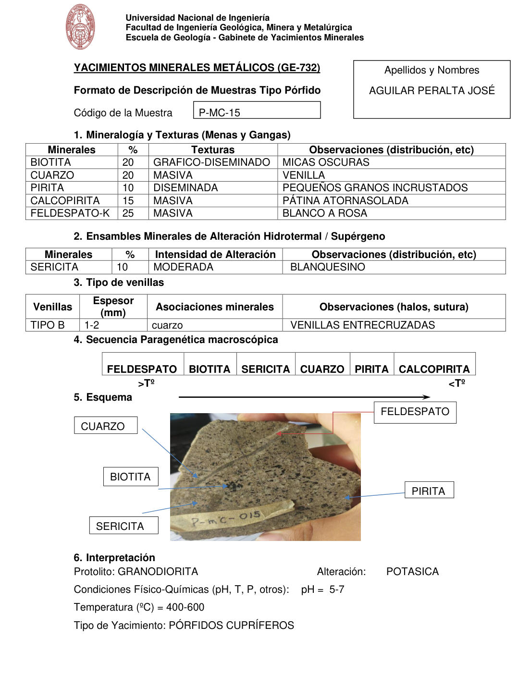

# Muestra P-MC-15

- **Autor:** Aguilar Peralta, Jose Luis
- **Formato:** GE-732 Tipo Porfido
- **Fuente:** YACIMIENTOS-AGUILAR_PERALTA_JOSE_LUIS.pdf (pagina 12)
- **Confianza transcripcion:** alta

## 1. Mineralogia y Texturas (Menas y Gangas)
| Mineral | % | Texturas | Observaciones |
|---|---|---|---|
| Biotita | 20 | Grafico-diseminado | Micas oscuras |
| Cuarzo | 20 | Masiva | Venilla |
| Pirita | 10 | Diseminada | Pequenos granos incrustados |
| Calcopirita | 15 | Masiva | Patina atornasolada |
| Feldespato-K | 25 | Masiva | Blanco a rosa |

## 2. Esquema
Fotografia de la muestra de mano con rotulo 'P-MC-015'. Roca porfiritica gris-verdosa con motas negras; etiquetas: cuarzo (venilla clara), feldespato, biotita, sericita y pirita.

## 3. Ensambles de Minerales de Alteracion
| Mineral | % | Intensidad | Observaciones |
|---|---|---|---|
| Sericita | 10 | moderada | Blanquecino |

## Tipo de venillas
| Venilla | Espesor (mm) | Asociaciones minerales | Observaciones |
|---|---|---|---|
| Tipo B | 1-2 | Cuarzo | Venillas entrecruzadas |

## 4. Secuencia paragenetica
De mayor a menor temperatura: feldespato, biotita, sericita, cuarzo, pirita y calcopirita.
| Mineral / asociacion | Etapa | Notas |
|---|---|---|
| Feldespato |  |  |
| Biotita |  |  |
| Sericita |  |  |
| Cuarzo |  |  |
| Pirita |  |  |
| Calcopirita |  |  |

## 5. Interpretacion
- **Protolito:** Granodiorita
- **Alteraciones:** Potasica
- **Condiciones Fisico-Quimicas:** pH = 5-7; Temperatura = 400-600 C
- **Tipo de Yacimiento:** Porfidos cupriferos

> Notas: PDF digital (texto seleccionable), no manuscrito: la transcripcion es literal. Hoja del formato 'YACIMIENTOS MINERALES METALICOS (GE-732) - Formato de Descripcion de Muestras Tipo Porfido', que ademas del GE-701 trae una seccion 'Tipo de venillas' (campo venillas). El esquema es una fotografia de la muestra de mano. Grupo del informe: B) Yacimientos tipo porfidos (separador en pagina 10). El rotulo de la foto dice 'P-mC-015'; el recuadro de codigo dice 'P-MC-15'.
