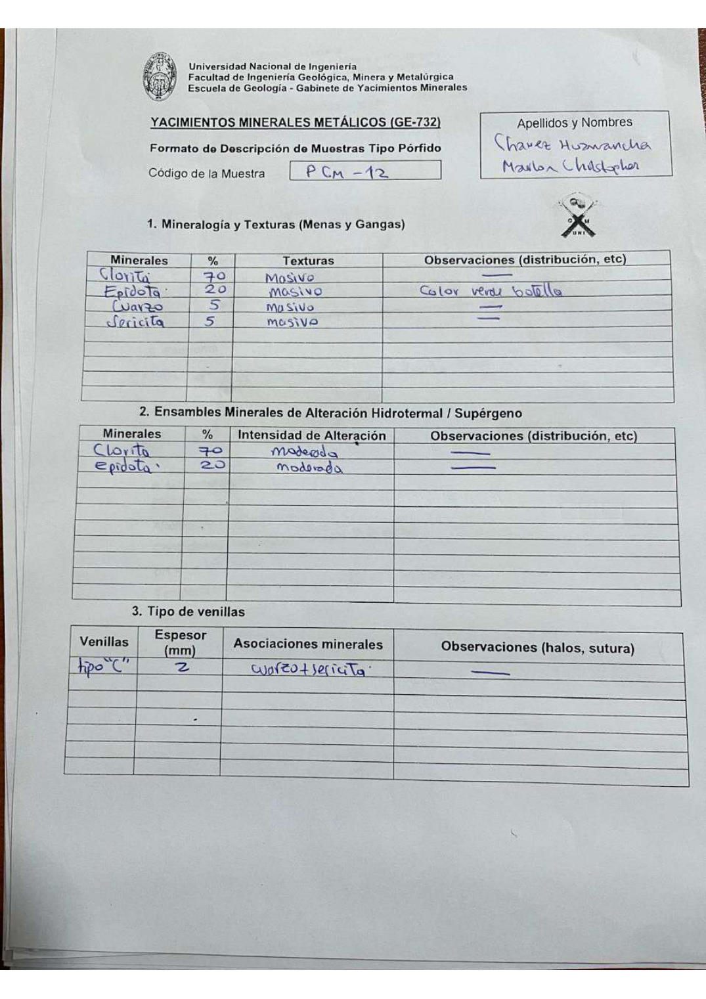

# Muestra PCM - 12

- **Autor:** Chavez Huamancha, Marlon Christopher
- **Formato:** GE-732 Tipo Porfido
- **Fuente:** PORFIDOS_MUESTRAS.pdf (pagina 1)
- **Confianza transcripcion:** alta

## 1. Mineralogia y Texturas (Menas y Gangas)
| Mineral | % | Texturas | Observaciones |
|---|---|---|---|
| Clorita | 70 | Masivo |  |
| Epidota | 20 | Masivo | Color verde botella |
| Cuarzo | 5 | Masivo |  |
| Sericita | 5 | Masivo |  |

## 2. Esquema
Dibujo de la muestra de fondo anaranjado (clorita) cortado por venillas tipo C; se senalan tambien epidota y clorita.

_Escala:_ 4 cm

## 3. Ensambles de Minerales de Alteracion
| Mineral | % | Intensidad | Observaciones |
|---|---|---|---|
| Clorita | 70 | moderada |  |
| Epidota | 20 | moderada |  |

## Tipo de venillas
| Venilla | Espesor (mm) | Asociaciones minerales | Observaciones |
|---|---|---|---|
| Tipo C | 2 | Cuarzo + sericita |  |

## 4. Secuencia paragenetica
De mayor a menor temperatura: cuarzo, clorita, epidota y sericita.
| Mineral / asociacion | Etapa | Notas |
|---|---|---|
| Cuarzo |  |  |
| Clorita |  |  |
| Epidota |  |  |
| Sericita |  |  |

## 5. Interpretacion
- **Protolito:** 
- **Alteraciones:** Propilitica
- **Condiciones Fisico-Quimicas:** pH basico; temperatura moderada
- **Tipo de Yacimiento:** Porfido de Cu

> Notas: Escaneo de hoja manuscrita, leido con vision. Cada muestra ocupa dos paginas (anverso con las secciones 1-3 y reverso con las 4-6), pero el PDF NO las trae consecutivas: el emparejamiento se reconstruyo por contenido. El campo 'pagina' apunta al anverso (el que lleva el codigo) y es la imagen guardada en page.jpg. Reverso de esta muestra: pagina 20. La casilla Protolito quedo en blanco.
