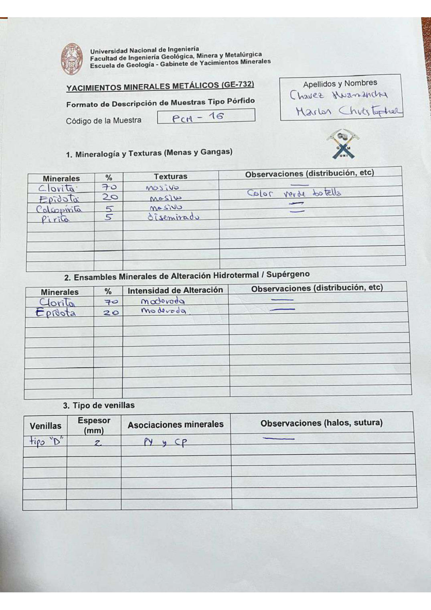

# Muestra PCM - 16

- **Autor:** Chavez Huamancha, Marlon Christopher
- **Formato:** GE-732 Tipo Porfido
- **Fuente:** PORFIDOS_MUESTRAS.pdf (pagina 7)
- **Confianza transcripcion:** alta

## 1. Mineralogia y Texturas (Menas y Gangas)
| Mineral | % | Texturas | Observaciones |
|---|---|---|---|
| Clorita | 70 | Masivo |  |
| Epidota | 20 | Masivo | Color verde botella |
| Calcopirita | 5 | Masivo |  |
| Pirita | 5 | Diseminado |  |

## 2. Esquema
Dibujo de la muestra de fondo anaranjado (clorita) con venillas naranjas entrecruzadas y granos alargados celestes dispersos.

_Escala:_ 4 cm

## 3. Ensambles de Minerales de Alteracion
| Mineral | % | Intensidad | Observaciones |
|---|---|---|---|
| Clorita | 70 | moderada |  |
| Epidota | 20 | moderada |  |

## Tipo de venillas
| Venilla | Espesor (mm) | Asociaciones minerales | Observaciones |
|---|---|---|---|
| Tipo D | 2 | Pirita y calcopirita |  |

## 4. Secuencia paragenetica
De mayor a menor temperatura: clorita, epidota, calcopirita y pirita.
| Mineral / asociacion | Etapa | Notas |
|---|---|---|
| Clorita |  |  |
| Epidota |  |  |
| Calcopirita |  |  |
| Pirita |  |  |

## 5. Interpretacion
- **Protolito:** 
- **Alteraciones:** Propilitico
- **Condiciones Fisico-Quimicas:** pH basico; temperatura moderada
- **Tipo de Yacimiento:** Porfido de Cu

> Notas: Escaneo de hoja manuscrita, leido con vision. Cada muestra ocupa dos paginas (anverso con las secciones 1-3 y reverso con las 4-6), pero el PDF NO las trae consecutivas: el emparejamiento se reconstruyo por contenido. El campo 'pagina' apunta al anverso (el que lleva el codigo) y es la imagen guardada en page.jpg. Reverso de esta muestra: pagina 8. La casilla Protolito quedo en blanco. En la tabla 3 las asociaciones figuran abreviadas como 'PY y CP'.
