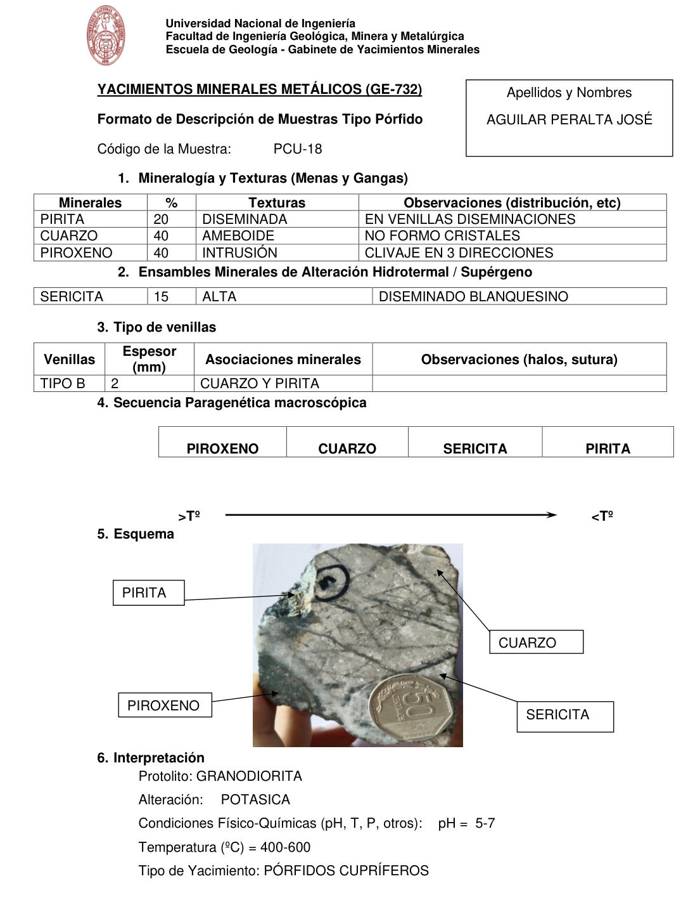

# Muestra PCU-18

- **Autor:** Aguilar Peralta, Jose Luis
- **Formato:** GE-732 Tipo Porfido
- **Fuente:** YACIMIENTOS-AGUILAR_PERALTA_JOSE_LUIS.pdf (pagina 19)
- **Confianza transcripcion:** alta

## 1. Mineralogia y Texturas (Menas y Gangas)
| Mineral | % | Texturas | Observaciones |
|---|---|---|---|
| Pirita | 20 | Diseminada | En venillas, diseminaciones |
| Cuarzo | 40 | Ameboide | No formo cristales |
| Piroxeno | 40 | Intrusion | Clivaje en 3 direcciones |

## 2. Esquema
Fotografia de la muestra de mano gris-verdosa con venillas oscuras y una moneda de 50 centimos como escala. Etiquetas: pirita, piroxeno, cuarzo y sericita.

_Escala:_ Moneda de 50 centimos en la foto

## 3. Ensambles de Minerales de Alteracion
| Mineral | % | Intensidad | Observaciones |
|---|---|---|---|
| Sericita | 15 | alta | Diseminado blanquecino |

## Tipo de venillas
| Venilla | Espesor (mm) | Asociaciones minerales | Observaciones |
|---|---|---|---|
| Tipo B | 2 | Cuarzo y pirita |  |

## 4. Secuencia paragenetica
De mayor a menor temperatura: piroxeno, cuarzo, sericita y pirita.
| Mineral / asociacion | Etapa | Notas |
|---|---|---|
| Piroxeno |  |  |
| Cuarzo |  |  |
| Sericita |  |  |
| Pirita |  |  |

## 5. Interpretacion
- **Protolito:** Granodiorita
- **Alteraciones:** Potasica
- **Condiciones Fisico-Quimicas:** pH = 5-7; Temperatura = 400-600 C
- **Tipo de Yacimiento:** Porfidos cupriferos

> Notas: PDF digital (texto seleccionable), no manuscrito: la transcripcion es literal. Hoja del formato 'YACIMIENTOS MINERALES METALICOS (GE-732) - Formato de Descripcion de Muestras Tipo Porfido', que ademas del GE-701 trae una seccion 'Tipo de venillas' (campo venillas). El esquema es una fotografia de la muestra de mano. Grupo del informe: B) Yacimientos tipo porfidos (separador en pagina 10). La tabla 2 (alteracion) se imprimio sin fila de encabezados.
