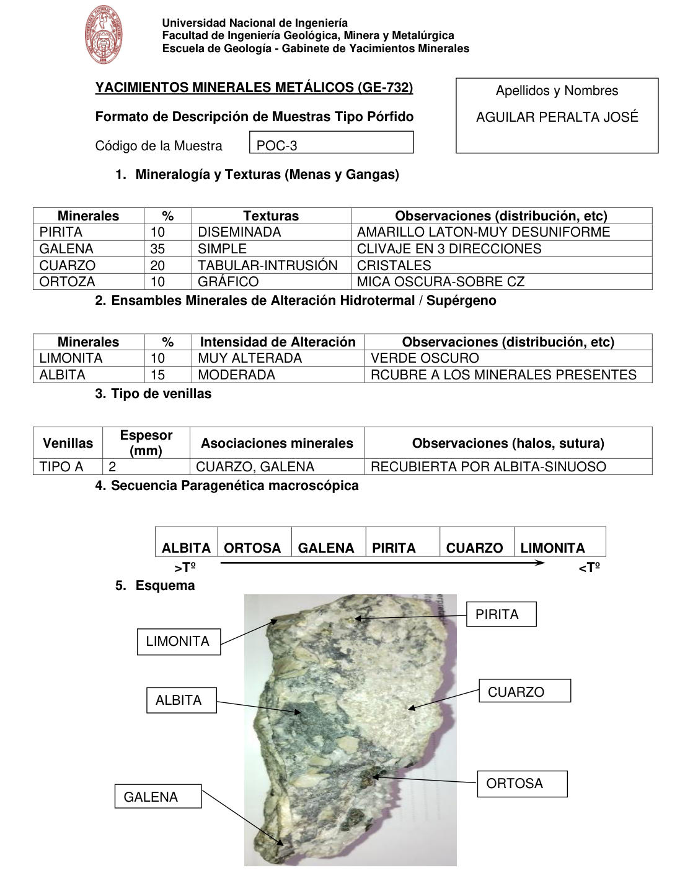

# Muestra POC-3

- **Autor:** Aguilar Peralta, Jose Luis
- **Formato:** GE-732 Tipo Porfido
- **Fuente:** YACIMIENTOS-AGUILAR_PERALTA_JOSE_LUIS.pdf (pagina 20)
- **Confianza transcripcion:** alta

## 1. Mineralogia y Texturas (Menas y Gangas)
| Mineral | % | Texturas | Observaciones |
|---|---|---|---|
| Pirita | 10 | Diseminada | Amarillo laton, muy desuniforme |
| Galena | 35 | Simple | Clivaje en 3 direcciones |
| Cuarzo | 20 | Tabular-intrusion | Cristales |
| Ortoza | 10 | Grafico | Mica oscura sobre cuarzo |

## 2. Esquema
Fotografia de la muestra de mano, clara con parches verde oscuro. Etiquetas: limonita, albita, galena, pirita, cuarzo y ortosa.

## 3. Ensambles de Minerales de Alteracion
| Mineral | % | Intensidad | Observaciones |
|---|---|---|---|
| Limonita | 10 | muy alterada | Verde oscuro |
| Albita | 15 | moderada | Recubre a los minerales presentes |

## Tipo de venillas
| Venilla | Espesor (mm) | Asociaciones minerales | Observaciones |
|---|---|---|---|
| Tipo A | 2 | Cuarzo, galena | Recubierta por albita, sinuoso |

## 4. Secuencia paragenetica
De mayor a menor temperatura: albita, ortosa, galena, pirita, cuarzo y limonita.
| Mineral / asociacion | Etapa | Notas |
|---|---|---|
| Albita |  |  |
| Ortosa |  |  |
| Galena |  |  |
| Pirita |  |  |
| Cuarzo |  |  |
| Limonita |  |  |

## 5. Interpretacion
- **Protolito:** Granito o granodiorita
- **Alteraciones:** Propilitica
- **Condiciones Fisico-Quimicas:** pH = 6-8; Temperatura = 100-300 C
- **Tipo de Yacimiento:** Porfido de cobre

> Notas: PDF digital (texto seleccionable), no manuscrito: la transcripcion es literal. Hoja del formato 'YACIMIENTOS MINERALES METALICOS (GE-732) - Formato de Descripcion de Muestras Tipo Porfido', que ademas del GE-701 trae una seccion 'Tipo de venillas' (campo venillas). El esquema es una fotografia de la muestra de mano. Grupo del informe: B) Yacimientos tipo porfidos (separador en pagina 10). Muestra repartida en dos paginas: las secciones 1 a 5 estan en la pagina 20 y la seccion 6 (Interpretacion) en la pagina 21; se guarda la imagen de la pagina 20. Repite el codigo 'POC-3' de la pagina 17 pero describe una muestra distinta, por eso se guarda como POC-3-b. En la tabla 1 figura 'ORTOZA' y en la secuencia paragenetica 'ORTOSA'.
