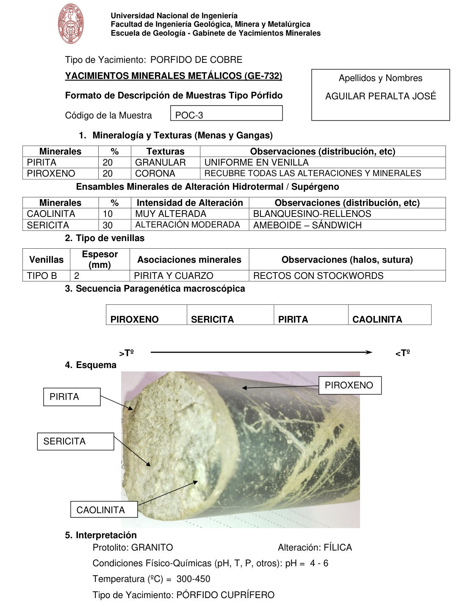

# Muestra POC-3

- **Autor:** Aguilar Peralta, Jose Luis
- **Formato:** GE-732 Tipo Porfido
- **Fuente:** YACIMIENTOS-AGUILAR_PERALTA_JOSE_LUIS.pdf (pagina 17)
- **Confianza transcripcion:** alta

## 1. Mineralogia y Texturas (Menas y Gangas)
| Mineral | % | Texturas | Observaciones |
|---|---|---|---|
| Pirita | 20 | Granular | Uniforme en venilla |
| Piroxeno | 20 | Corona | Recubre todas las alteraciones y minerales |

## 2. Esquema
Fotografia de un testigo (core): mitad izquierda clara con pirita, sericita y caolinita; mitad derecha verde oscura de piroxeno con venillas blancas entrecruzadas.

## 3. Ensambles de Minerales de Alteracion
| Mineral | % | Intensidad | Observaciones |
|---|---|---|---|
| Caolinita | 10 | muy alterada | Blanquecino, rellenos |
| Sericita | 30 | moderada | Ameboide, sandwich |

## Tipo de venillas
| Venilla | Espesor (mm) | Asociaciones minerales | Observaciones |
|---|---|---|---|
| Tipo B | 2 | Pirita y cuarzo | Rectos con stockworks |

## 4. Secuencia paragenetica
De mayor a menor temperatura: piroxeno, sericita, pirita y caolinita.
| Mineral / asociacion | Etapa | Notas |
|---|---|---|
| Piroxeno |  |  |
| Sericita |  |  |
| Pirita |  |  |
| Caolinita |  |  |

## 5. Interpretacion
- **Protolito:** Granito
- **Alteraciones:** Filica
- **Condiciones Fisico-Quimicas:** pH = 4-6; Temperatura = 300-450 C
- **Tipo de Yacimiento:** Porfido cuprifero

> Notas: PDF digital (texto seleccionable), no manuscrito: la transcripcion es literal. Hoja del formato 'YACIMIENTOS MINERALES METALICOS (GE-732) - Formato de Descripcion de Muestras Tipo Porfido', que ademas del GE-701 trae una seccion 'Tipo de venillas' (campo venillas). El esquema es una fotografia de la muestra de mano. Grupo del informe: B) Yacimientos tipo porfidos (separador en pagina 10). La linea 'Tipo de Yacimiento: PORFIDO DE COBRE' al inicio de esta pagina NO pertenece a esta muestra: es el desborde de la hoja PTM-2 (pagina 16). En esta hoja la numeracion de secciones salta: la de ensambles de alteracion va sin numero y 'Tipo de venillas' figura como 2. La hoja de la pagina 20 repite este mismo codigo; ver POC-3-b. 'STOCKWORDS' en el original (por stockworks).
