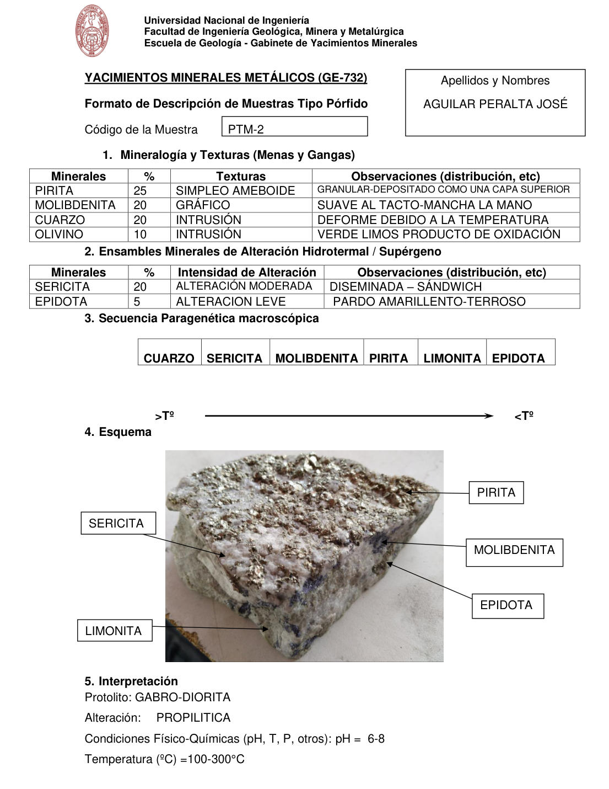

# Muestra PTM-2

- **Autor:** Aguilar Peralta, Jose Luis
- **Formato:** GE-732 Tipo Porfido
- **Fuente:** YACIMIENTOS-AGUILAR_PERALTA_JOSE_LUIS.pdf (pagina 16)
- **Confianza transcripcion:** alta

## 1. Mineralogia y Texturas (Menas y Gangas)
| Mineral | % | Texturas | Observaciones |
|---|---|---|---|
| Pirita | 25 | Simple o ameboide | Granular, depositado como una capa superior |
| Molibdenita | 20 | Grafico | Suave al tacto; mancha la mano |
| Cuarzo | 20 | Intrusion | Deforme debido a la temperatura |
| Olivino | 10 | Intrusion | Verde limos, producto de oxidacion |

## 2. Esquema
Fotografia de la muestra de mano, blanquecina con abundante pirita metalica en la cara superior. Etiquetas: pirita, molibdenita, epidota, sericita y limonita.

## 3. Ensambles de Minerales de Alteracion
| Mineral | % | Intensidad | Observaciones |
|---|---|---|---|
| Sericita | 20 | moderada | Diseminada, sandwich |
| Epidota | 5 | leve | Pardo amarillento, terroso |

## 4. Secuencia paragenetica
De mayor a menor temperatura: cuarzo, sericita, molibdenita, pirita, limonita y epidota.
| Mineral / asociacion | Etapa | Notas |
|---|---|---|
| Cuarzo |  |  |
| Sericita |  |  |
| Molibdenita |  |  |
| Pirita |  |  |
| Limonita |  |  |
| Epidota |  |  |

## 5. Interpretacion
- **Protolito:** Gabro-diorita
- **Alteraciones:** Propilitica
- **Condiciones Fisico-Quimicas:** pH = 6-8; Temperatura = 100-300 C
- **Tipo de Yacimiento:** Porfido de cobre

> Notas: PDF digital (texto seleccionable), no manuscrito: la transcripcion es literal. Hoja del formato 'YACIMIENTOS MINERALES METALICOS (GE-732) - Formato de Descripcion de Muestras Tipo Porfido', que ademas del GE-701 trae una seccion 'Tipo de venillas' (campo venillas). El esquema es una fotografia de la muestra de mano. Grupo del informe: B) Yacimientos tipo porfidos (separador en pagina 10). Esta hoja NO trae la seccion 'Tipo de venillas'. La linea 'Tipo de Yacimiento: PORFIDO DE COBRE' de esta muestra quedo desbordada al inicio de la pagina 17.
