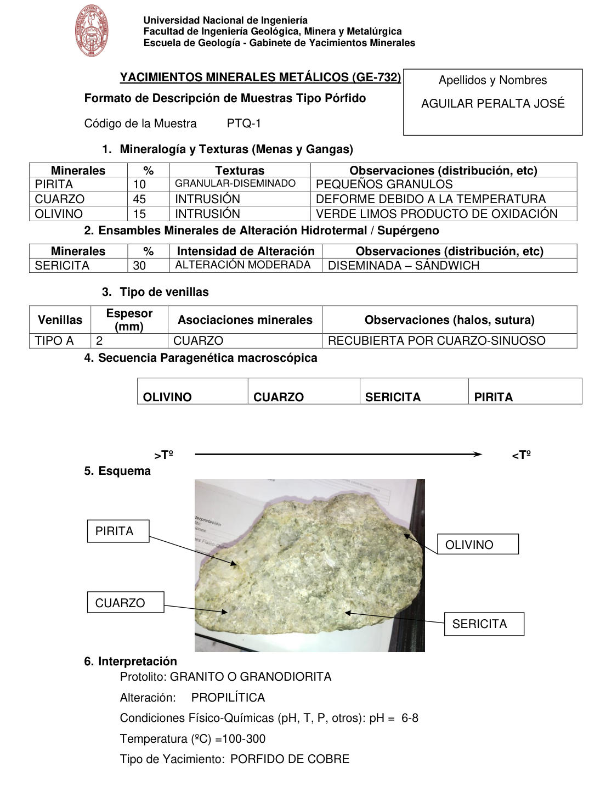

# Muestra PTQ-1

- **Autor:** Aguilar Peralta, Jose Luis
- **Formato:** GE-732 Tipo Porfido
- **Fuente:** YACIMIENTOS-AGUILAR_PERALTA_JOSE_LUIS.pdf (pagina 18)
- **Confianza transcripcion:** alta

## 1. Mineralogia y Texturas (Menas y Gangas)
| Mineral | % | Texturas | Observaciones |
|---|---|---|---|
| Pirita | 10 | Granular-diseminado | Pequenos granulos |
| Cuarzo | 45 | Intrusion | Deforme debido a la temperatura |
| Olivino | 15 | Intrusion | Verde limos, producto de oxidacion |

## 2. Esquema
Fotografia de la muestra de mano, verde amarillenta y granular. Etiquetas: pirita, cuarzo, olivino y sericita.

## 3. Ensambles de Minerales de Alteracion
| Mineral | % | Intensidad | Observaciones |
|---|---|---|---|
| Sericita | 30 | moderada | Diseminada, sandwich |

## Tipo de venillas
| Venilla | Espesor (mm) | Asociaciones minerales | Observaciones |
|---|---|---|---|
| Tipo A | 2 | Cuarzo | Recubierta por cuarzo, sinuoso |

## 4. Secuencia paragenetica
De mayor a menor temperatura: olivino, cuarzo, sericita y pirita.
| Mineral / asociacion | Etapa | Notas |
|---|---|---|
| Olivino |  |  |
| Cuarzo |  |  |
| Sericita |  |  |
| Pirita |  |  |

## 5. Interpretacion
- **Protolito:** Granito o granodiorita
- **Alteraciones:** Propilitica
- **Condiciones Fisico-Quimicas:** pH = 6-8; Temperatura = 100-300 C
- **Tipo de Yacimiento:** Porfido de cobre

> Notas: PDF digital (texto seleccionable), no manuscrito: la transcripcion es literal. Hoja del formato 'YACIMIENTOS MINERALES METALICOS (GE-732) - Formato de Descripcion de Muestras Tipo Porfido', que ademas del GE-701 trae una seccion 'Tipo de venillas' (campo venillas). El esquema es una fotografia de la muestra de mano. Grupo del informe: B) Yacimientos tipo porfidos (separador en pagina 10).
