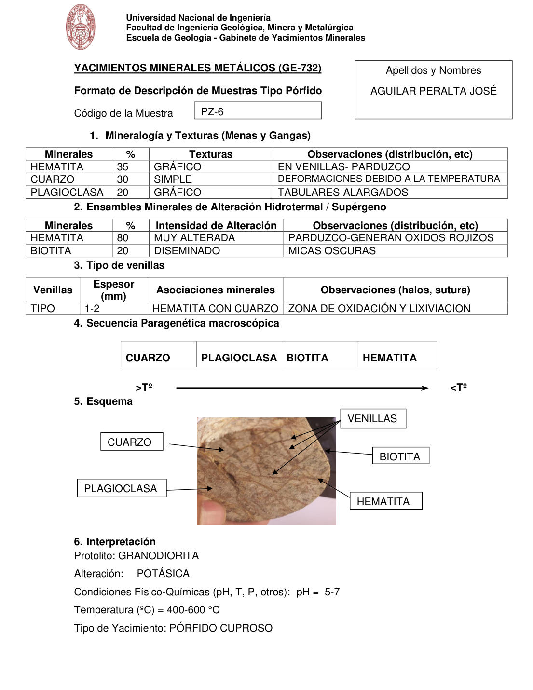

# Muestra PZ-6

- **Autor:** Aguilar Peralta, Jose Luis
- **Formato:** GE-732 Tipo Porfido
- **Fuente:** YACIMIENTOS-AGUILAR_PERALTA_JOSE_LUIS.pdf (pagina 15)
- **Confianza transcripcion:** alta

## 1. Mineralogia y Texturas (Menas y Gangas)
| Mineral | % | Texturas | Observaciones |
|---|---|---|---|
| Hematita | 35 | Grafico | En venillas, parduzco |
| Cuarzo | 30 | Simple | Deformaciones debido a la temperatura |
| Plagioclasa | 20 | Grafico | Tabulares-alargados |

## 2. Esquema
Fotografia de la muestra de mano, pardo clara, cortada por venillas oscuras entrecruzadas. Etiquetas: cuarzo, plagioclasa, venillas, biotita y hematita.

## 3. Ensambles de Minerales de Alteracion
| Mineral | % | Intensidad | Observaciones |
|---|---|---|---|
| Hematita | 80 | muy alterada | Parduzco; generan oxidos rojizos |
| Biotita | 20 | diseminado | Micas oscuras |

## Tipo de venillas
| Venilla | Espesor (mm) | Asociaciones minerales | Observaciones |
|---|---|---|---|
| Tipo (sin letra) | 1-2 | Hematita con cuarzo | Zona de oxidacion y lixiviacion |

## 4. Secuencia paragenetica
De mayor a menor temperatura: cuarzo, plagioclasa, biotita y hematita.
| Mineral / asociacion | Etapa | Notas |
|---|---|---|
| Cuarzo |  |  |
| Plagioclasa |  |  |
| Biotita |  |  |
| Hematita |  |  |

## 5. Interpretacion
- **Protolito:** Granodiorita
- **Alteraciones:** Potasica
- **Condiciones Fisico-Quimicas:** pH = 5-7; Temperatura = 400-600 C
- **Tipo de Yacimiento:** Porfido cuproso

> Notas: PDF digital (texto seleccionable), no manuscrito: la transcripcion es literal. Hoja del formato 'YACIMIENTOS MINERALES METALICOS (GE-732) - Formato de Descripcion de Muestras Tipo Porfido', que ademas del GE-701 trae una seccion 'Tipo de venillas' (campo venillas). El esquema es una fotografia de la muestra de mano. Grupo del informe: B) Yacimientos tipo porfidos (separador en pagina 10). En la tabla de venillas la celda 'Venillas' solo dice 'TIPO', sin la letra.
