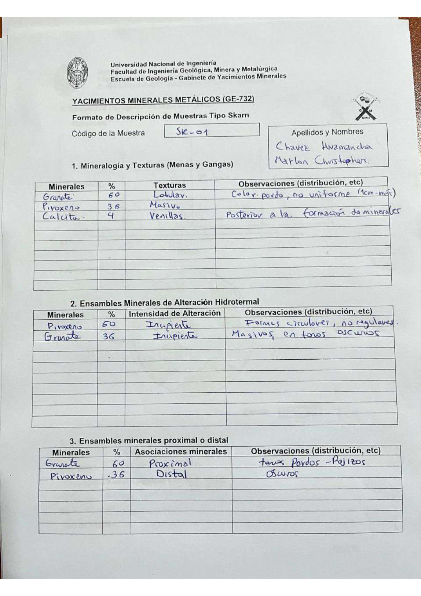

# Muestra SK - 01

- **Autor:** Chavez Huamancha, Marlon Christopher
- **Formato:** GE-732 Tipo Skarn
- **Fuente:** SKARN_MUESTRAS.pdf (pagina 11)
- **Confianza transcripcion:** alta

## 1. Mineralogia y Texturas (Menas y Gangas)
| Mineral | % | Texturas | Observaciones |
|---|---|---|---|
| Granate | 60 | Lobular | Color pardo, no uniforme (1 cm - mas) |
| Piroxeno | 36 | Masivo |  |
| Calcita | 4 | Venillas | Posterior a la formacion de minerales |

## 2. Esquema
Dibujo circular (vista de lupa) con parches anaranjados lobulados de contorno irregular repartidos sobre fondo claro.

_Escala:_ 2 cm

## 3. Ensambles de Minerales de Alteracion
| Mineral | % | Intensidad | Observaciones |
|---|---|---|---|
| Piroxeno | 60 | incipiente | Formas circulares, no regulares |
| Granate | 36 | incipiente | Masivos, en tonos oscuros |

## Ensambles minerales proximal / distal
| Mineral | % | Asociacion | Observaciones |
|---|---|---|---|
| Granate | 60 | proximal | Tonos pardos-rojizos |
| Piroxeno | 36 | distal | Oscuros |

## 4. Secuencia paragenetica
Granate primero, luego piroxeno y finalmente calcita.
| Mineral / asociacion | Etapa | Notas |
|---|---|---|
| Granate |  |  |
| Piroxeno |  |  |
| Calcita |  |  |

## 5. Interpretacion
- **Protolito:** Progado skarn
- **Alteraciones:** Prograda skarn
- **Condiciones Fisico-Quimicas:** Altas temperaturas; pH basico
- **Tipo de Yacimiento:** Skarn

> Notas: Escaneo de hoja manuscrita, leido con vision. Cada muestra ocupa dos paginas (anverso con las secciones 1-3 y reverso con las 4-6) y el PDF NO las trae consecutivas: el emparejamiento se reconstruyo por contenido. El campo 'pagina' apunta al anverso (el que lleva el codigo) y es la imagen guardada en page.jpg. Reverso de esta muestra: pagina 2. En la tabla 2 los porcentajes de piroxeno (60) y granate (36) aparecen intercambiados respecto a la tabla 1 (granate 60, piroxeno 36); se transcribe lo que dice cada tabla. Ojo: existe ademas una muestra 'SK01' de Aguilar Peralta (carpeta SK01), que es otra muestra distinta.
