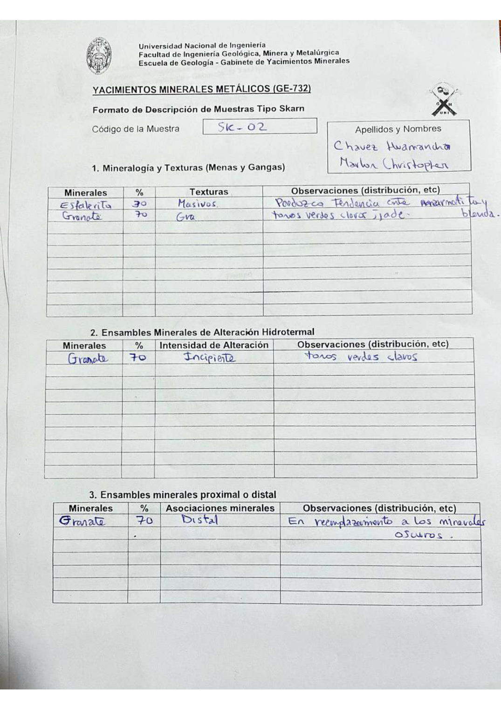

# Muestra SK - 02

- **Autor:** Chavez Huamancha, Marlon Christopher
- **Formato:** GE-732 Tipo Skarn
- **Fuente:** SKARN_MUESTRAS.pdf (pagina 1)
- **Confianza transcripcion:** alta

## 1. Mineralogia y Texturas (Menas y Gangas)
| Mineral | % | Texturas | Observaciones |
|---|---|---|---|
| Esfalerita | 30 | Masivos | Parduzco; tendencia entre marmatita y blenda |
| Granate | 70 | Granular | Tonos verdes claros, jade |

## 2. Esquema
Dibujo circular (vista de lupa): fondo claro con parches anaranjados irregulares dispersos.

_Escala:_ 2 cm

## 3. Ensambles de Minerales de Alteracion
| Mineral | % | Intensidad | Observaciones |
|---|---|---|---|
| Granate | 70 | incipiente | Tonos verdes claros |

## Ensambles minerales proximal / distal
| Mineral | % | Asociacion | Observaciones |
|---|---|---|---|
| Granate | 70 | distal | En reemplazamiento a los minerales oscuros |

## 4. Secuencia paragenetica
Granate primero y esfalerita despues.
| Mineral / asociacion | Etapa | Notas |
|---|---|---|
| Granate |  |  |
| Esfalerita |  |  |

## 5. Interpretacion
- **Protolito:** 
- **Alteraciones:** Skarn - prograda
- **Condiciones Fisico-Quimicas:** Altas temperaturas; pH basico
- **Tipo de Yacimiento:** Skarn

> Notas: Escaneo de hoja manuscrita, leido con vision. Cada muestra ocupa dos paginas (anverso con las secciones 1-3 y reverso con las 4-6) y el PDF NO las trae consecutivas: el emparejamiento se reconstruyo por contenido. El campo 'pagina' apunta al anverso (el que lleva el codigo) y es la imagen guardada en page.jpg. Reverso de esta muestra: pagina 4. ATENCION: el codigo 'SK-02' ya lo usa una muestra de Aguilar Peralta (YACIMIENTOS-AGUILAR_PERALTA_JOSE_LUIS.pdf p32), que es otra muestra; por eso esta se guarda en SK-02-b. La textura del granate se lee truncada ('Gra...'), probablemente 'granular'. La casilla Protolito lleva solo unos guiones.
