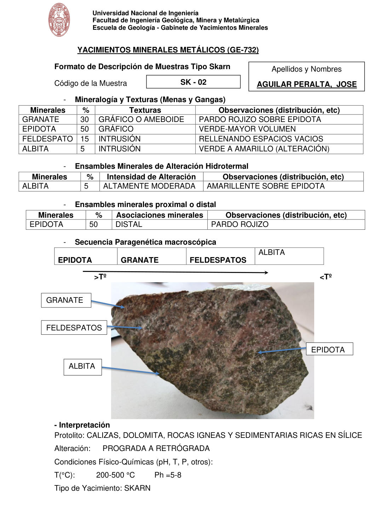

# Muestra SK - 02

- **Autor:** Aguilar Peralta, Jose Luis
- **Formato:** GE-732 Tipo Skarn
- **Fuente:** YACIMIENTOS-AGUILAR_PERALTA_JOSE_LUIS.pdf (pagina 32)
- **Confianza transcripcion:** alta

## 1. Mineralogia y Texturas (Menas y Gangas)
| Mineral | % | Texturas | Observaciones |
|---|---|---|---|
| Granate | 30 | Grafico o ameboide | Pardo rojizo sobre epidota |
| Epidota | 50 | Grafico | Verde, mayor volumen |
| Feldespato | 15 | Intrusion | Rellenando espacios vacios |
| Albita | 5 | Intrusion | Verde a amarillo (alteracion) |

## 2. Esquema
Fotografia de la muestra de mano, moteada rosada y verde. Etiquetas: granate, feldespatos, albita y epidota.

## 3. Ensambles de Minerales de Alteracion
| Mineral | % | Intensidad | Observaciones |
|---|---|---|---|
| Albita | 5 | altamente moderada | Amarillento sobre epidota |

## Ensambles minerales proximal / distal
| Mineral | % | Asociacion | Observaciones |
|---|---|---|---|
| Epidota | 50 | distal | Pardo rojizo |

## 4. Secuencia paragenetica
De mayor a menor temperatura: epidota, granate, feldespatos y albita.
| Mineral / asociacion | Etapa | Notas |
|---|---|---|
| Epidota |  |  |
| Granate |  |  |
| Feldespatos |  |  |
| Albita |  |  |

## 5. Interpretacion
- **Protolito:** Calizas, dolomita, rocas igneas y sedimentarias ricas en silice
- **Alteraciones:** Prograda a retrograda
- **Condiciones Fisico-Quimicas:** T = 200-500 C; pH = 5-8
- **Tipo de Yacimiento:** Skarn

> Notas: PDF digital (texto seleccionable), no manuscrito: la transcripcion es literal. Hoja del formato 'YACIMIENTOS MINERALES METALICOS (GE-732) - Formato de Descripcion de Muestras Tipo Skarn', que trae una seccion 'Ensambles minerales proximal o distal' (campo ensambles_proximal_distal) ausente del GE-701. El esquema es una fotografia de la muestra de mano. Grupo del informe: C) Yacimiento tipo skarn (separador en pagina 22). En la tabla de alteracion el original escribe 'AMARILLENTE'.
