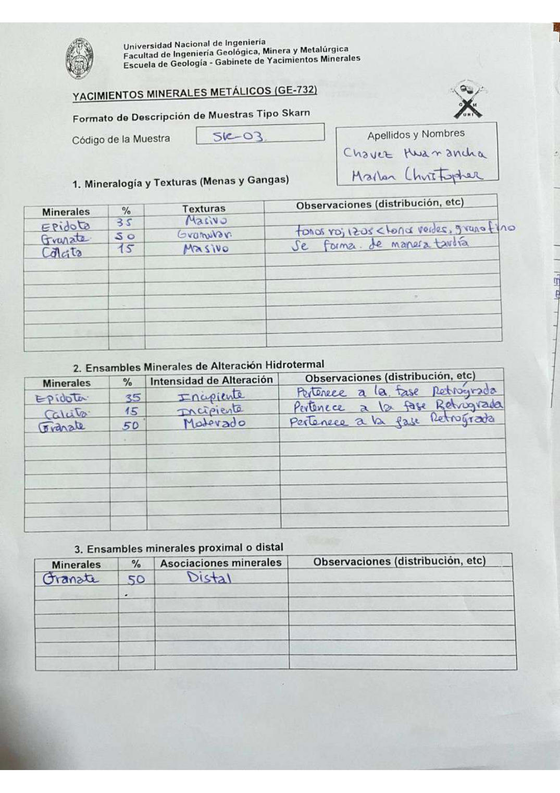

# Muestra SK - 03

- **Autor:** Chavez Huamancha, Marlon Christopher
- **Formato:** GE-732 Tipo Skarn
- **Fuente:** SKARN_MUESTRAS.pdf (pagina 3)
- **Confianza transcripcion:** alta

## 1. Mineralogia y Texturas (Menas y Gangas)
| Mineral | % | Texturas | Observaciones |
|---|---|---|---|
| Epidota | 35 | Masivo |  |
| Granate | 50 | Granular | Tonos rojizos < tonos verdes, grano fino |
| Calcita | 15 | Masivo | Se forma de manera tardia |

## 2. Esquema
Dibujo circular (vista de lupa) con parches anaranjados ramificados (granate), una banda verde-azulada inferior (epidota) y zonas claras (calcita) senaladas con flechas.

## 3. Ensambles de Minerales de Alteracion
| Mineral | % | Intensidad | Observaciones |
|---|---|---|---|
| Epidota | 35 | incipiente | Pertenece a la fase retrograda |
| Calcita | 15 | incipiente | Pertenece a la fase retrograda |
| Granate | 50 | moderada | Pertenece a la fase retrograda |

## Ensambles minerales proximal / distal
| Mineral | % | Asociacion | Observaciones |
|---|---|---|---|
| Granate | 50 | distal |  |

## 4. Secuencia paragenetica
Granate y epidota a mayor temperatura, calcita al final.
| Mineral / asociacion | Etapa | Notas |
|---|---|---|
| Granate |  |  |
| Epidota |  | Comparte casilla con el granate |
| Calcita |  |  |

## 5. Interpretacion
- **Protolito:** 
- **Alteraciones:** Prograda y retrograda
- **Condiciones Fisico-Quimicas:** T altas (prograda), bajas (retrograda); pH basico
- **Tipo de Yacimiento:** Skarn

> Notas: Escaneo de hoja manuscrita, leido con vision. Cada muestra ocupa dos paginas (anverso con las secciones 1-3 y reverso con las 4-6) y el PDF NO las trae consecutivas: el emparejamiento se reconstruyo por contenido. El campo 'pagina' apunta al anverso (el que lleva el codigo) y es la imagen guardada en page.jpg. Reverso de esta muestra: pagina 6. La casilla Protolito lleva solo unos guiones.
