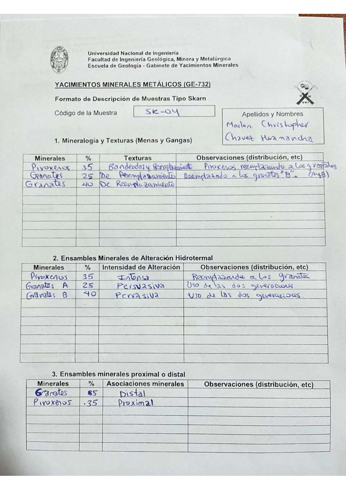

# Muestra SK - 04

- **Autor:** Chavez Huamancha, Marlon Christopher
- **Formato:** GE-732 Tipo Skarn
- **Fuente:** SKARN_MUESTRAS.pdf (pagina 5)
- **Confianza transcripcion:** alta

## 1. Mineralogia y Texturas (Menas y Gangas)
| Mineral | % | Texturas | Observaciones |
|---|---|---|---|
| Piroxenos | 35 | Bandeados y reemplazamiento | Piroxenos reemplazando a los granates |
| Granates A | 25 | De reemplazamiento | Reemplazado a los granates 'B' (A y B) |
| Granates B | 40 | De reemplazamiento |  |

## 2. Esquema
Dibujo circular (vista de lupa) con cristales alargados celestes orientados en diagonal sobre fondo claro.

_Escala:_ 2 cm

## 3. Ensambles de Minerales de Alteracion
| Mineral | % | Intensidad | Observaciones |
|---|---|---|---|
| Piroxenos | 35 | intensa | Reemplazando a los granates |
| Granates A | 25 | pervasiva | Uso de las dos generaciones |
| Granates B | 40 | pervasiva | Uso de las dos generaciones |

## Ensambles minerales proximal / distal
| Mineral | % | Asociacion | Observaciones |
|---|---|---|---|
| Granates | 65 | distal |  |
| Piroxenos | 35 | proximal |  |

## 4. Secuencia paragenetica
Granates A primero; despues granates B junto con piroxenos, y piroxenos hasta el final.
| Mineral / asociacion | Etapa | Notas |
|---|---|---|
| Granates A |  |  |
| Granates B |  |  |
| Piroxenos |  | Abarca las dos ultimas casillas |

## 5. Interpretacion
- **Protolito:** Roca calcarea
- **Alteraciones:** Del skarn (metamorfismo)
- **Condiciones Fisico-Quimicas:** Temperaturas altas; pH neutro a acido
- **Tipo de Yacimiento:** Skarn

> Notas: Escaneo de hoja manuscrita, leido con vision. Cada muestra ocupa dos paginas (anverso con las secciones 1-3 y reverso con las 4-6) y el PDF NO las trae consecutivas: el emparejamiento se reconstruyo por contenido. El campo 'pagina' apunta al anverso (el que lleva el codigo) y es la imagen guardada en page.jpg. Reverso de esta muestra: pagina 8. En la tabla 1 las dos generaciones de granate figuran ambas como 'Granates' (25 y 40 %); en la tabla 2 se distinguen como 'Granates A' y 'Granates B', y asi se transcriben. El recuadro de autor invierte el orden: 'Marlon Christopher / Chavez Huamancha'.
