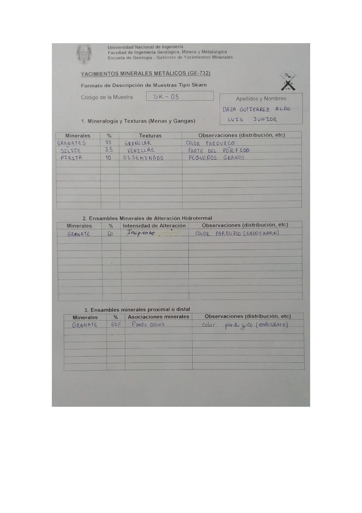

# Muestra SK - 05

- **Autor:** Daza Gutierrez, Aldo Luis Junior
- **Formato:** GE-732 Tipo Skarn
- **Fuente:** YACIMIENTO_SKARN.pdf (pagina 19)
- **Confianza transcripcion:** alta

## 1. Mineralogia y Texturas (Menas y Gangas)
| Mineral | % | Texturas | Observaciones |
|---|---|---|---|
| Granates | 55 | Granular | Color parduzco |
| Silice | 35 | Venillas | Parte del porfido |
| Pirita | 10 | Diseminado | Pequenos granos |

## 2. Esquema
Dibujo de la muestra de fondo gris con una zona celeste de silice a la izquierda, una venilla azul diagonal y granos de pirita y granate a la derecha.

_Escala:_ 4 cm

## 3. Ensambles de Minerales de Alteracion
| Mineral | % | Intensidad | Observaciones |
|---|---|---|---|
| Granate | 60 | incipiente | Color parduzco (endoskarn) |

## Ensambles minerales proximal / distal
| Mineral | % | Asociacion | Observaciones |
|---|---|---|---|
| Granate | 60 | pardo oscuro | Color parduzco (endoskarn) |

## 4. Secuencia paragenetica
Granate, luego cuarzo y finalmente pirita.
| Mineral / asociacion | Etapa | Notas |
|---|---|---|
| Granate |  |  |
| Cuarzo |  |  |
| Pirita |  |  |

## 5. Interpretacion
- **Protolito:** Sistema porfido - skarn
- **Alteraciones:** 
- **Condiciones Fisico-Quimicas:** Alta temperatura, alta presion; pH basico
- **Tipo de Yacimiento:** Skarn (endoskarn)

> Notas: Escaneo de hoja manuscrita, leido con vision. Cada muestra ocupa dos paginas consecutivas (anverso con las secciones 1-3 y reverso con las 4-6). El campo 'pagina' apunta al anverso, que es la imagen guardada en page.jpg. Reverso de esta muestra: pagina 20. ATENCION: el codigo 'SK-05' ya lo usa una muestra de Chavez Huamancha (SKARN_MUESTRAS.pdf p7), que es otra muestra; por eso esta se guarda en SK-05-b. El granate figura con 55 % en la tabla 1 y con 60 % en las tablas 2 y 3. En la tabla proximal/distal la columna de asociaciones dice 'Pardo oscuro' en vez de proximal o distal; se transcribe tal cual. La casilla Alteracion quedo vacia.
