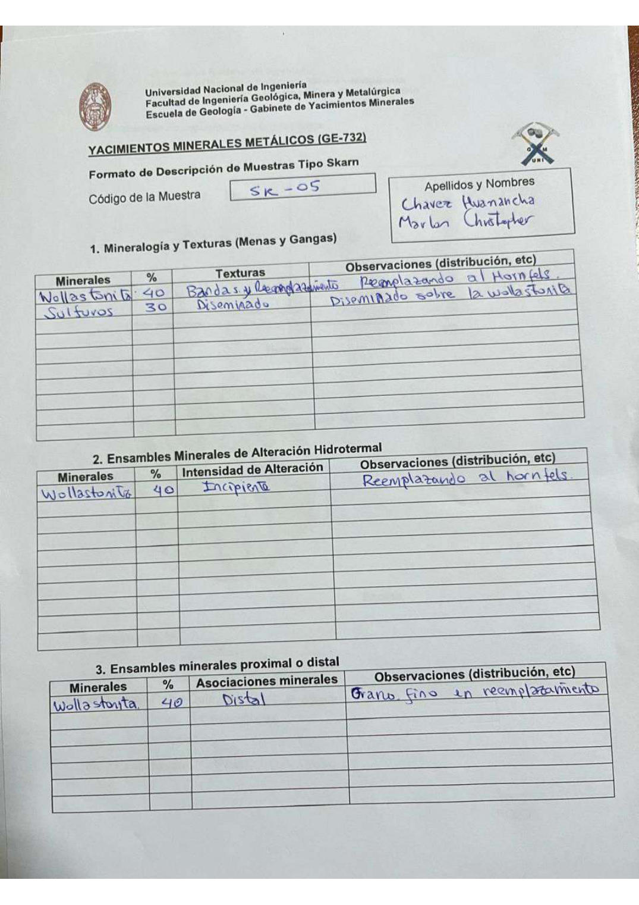

# Muestra SK - 05

- **Autor:** Chavez Huamancha, Marlon Christopher
- **Formato:** GE-732 Tipo Skarn
- **Fuente:** SKARN_MUESTRAS.pdf (pagina 7)
- **Confianza transcripcion:** alta

## 1. Mineralogia y Texturas (Menas y Gangas)
| Mineral | % | Texturas | Observaciones |
|---|---|---|---|
| Wollastonita | 40 | Bandas y reemplazamiento | Reemplazando al hornfels |
| Sulfuros | 30 | Diseminado | Diseminado sobre la wollastonita |

## 2. Esquema
Dibujo circular (vista de lupa) de fondo anaranjado (wollastonita) atravesado por bandas azul-verdosas verticales y sinuosas (sulfuros).

## 3. Ensambles de Minerales de Alteracion
| Mineral | % | Intensidad | Observaciones |
|---|---|---|---|
| Wollastonita | 40 | incipiente | Reemplazando al hornfels |

## Ensambles minerales proximal / distal
| Mineral | % | Asociacion | Observaciones |
|---|---|---|---|
| Wollastonita | 40 | distal | Grano fino en reemplazamiento |

## 4. Secuencia paragenetica
Wollastonita primero y sulfuros despues.
| Mineral / asociacion | Etapa | Notas |
|---|---|---|
| Wollastonita |  |  |
| Sulfuros |  |  |

## 5. Interpretacion
- **Protolito:** Caliza
- **Alteraciones:** Skarn - fase prograda
- **Condiciones Fisico-Quimicas:** Altas temperaturas; pH basico
- **Tipo de Yacimiento:** Skarn

> Notas: Escaneo de hoja manuscrita, leido con vision. Cada muestra ocupa dos paginas (anverso con las secciones 1-3 y reverso con las 4-6) y el PDF NO las trae consecutivas: el emparejamiento se reconstruyo por contenido. El campo 'pagina' apunta al anverso (el que lleva el codigo) y es la imagen guardada en page.jpg. Reverso de esta muestra: pagina 10. Ojo: existe ademas una muestra 'SK - 5' de Aguilar Peralta (carpeta SK-5), que es otra muestra distinta.
