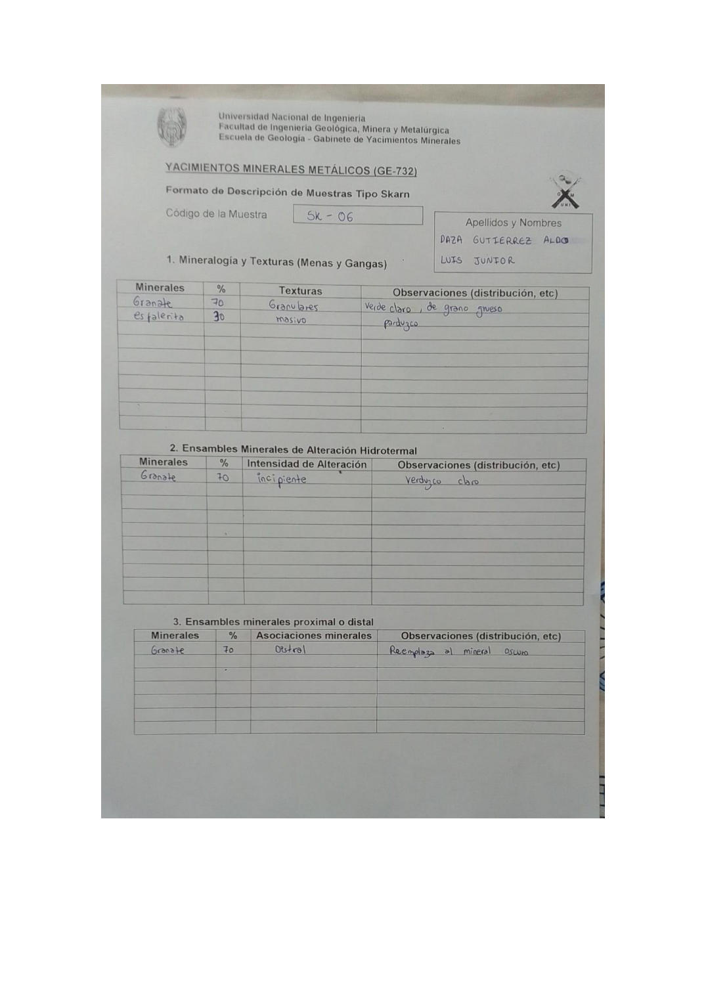

# Muestra SK - 06

- **Autor:** Daza Gutierrez, Aldo Luis Junior
- **Formato:** GE-732 Tipo Skarn
- **Fuente:** YACIMIENTO_SKARN.pdf (pagina 13)
- **Confianza transcripcion:** alta

## 1. Mineralogia y Texturas (Menas y Gangas)
| Mineral | % | Texturas | Observaciones |
|---|---|---|---|
| Granate | 70 | Granulares | Verde claro, de grano grueso |
| Esfalerita | 30 | Masivo | Parduzco |

## 2. Esquema
Dibujo de la muestra de contorno redondeado, con matriz gris (esfalerita) y masas verdes de granate en el centro.

_Escala:_ 2 cm

## 3. Ensambles de Minerales de Alteracion
| Mineral | % | Intensidad | Observaciones |
|---|---|---|---|
| Granate | 70 | incipiente | Verduzco claro |

## Ensambles minerales proximal / distal
| Mineral | % | Asociacion | Observaciones |
|---|---|---|---|
| Granate | 70 | distal | Reemplaza al mineral oscuro |

## 4. Secuencia paragenetica
Granate primero y esfalerita despues.
| Mineral / asociacion | Etapa | Notas |
|---|---|---|
| Granate |  |  |
| Esfalerita |  |  |

## 5. Interpretacion
- **Protolito:** 
- **Alteraciones:** Skarn - prograda
- **Condiciones Fisico-Quimicas:** Altas temperaturas; pH basico
- **Tipo de Yacimiento:** Skarn

> Notas: Escaneo de hoja manuscrita, leido con vision. Cada muestra ocupa dos paginas consecutivas (anverso con las secciones 1-3 y reverso con las 4-6). El campo 'pagina' apunta al anverso, que es la imagen guardada en page.jpg. Reverso de esta muestra: pagina 14. ATENCION: el codigo 'SK-06' ya lo usa una muestra de Chavez Huamancha (SKARN_MUESTRAS.pdf p9), que es otra muestra; por eso esta se guarda en SK-06-b. Es la misma muestra que SK-02 de Chavez Huamancha (SKARN_MUESTRAS.pdf p1, carpeta SK-02-b): esfalerita 30 y granate 70. En la tabla proximal/distal figura 'distral'. La casilla Protolito quedo vacia.
